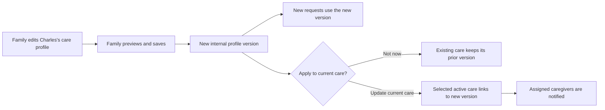

# LoLo Care Recipient Profile Product and Engineering Specification

Status: Proposed

Audience: Product, design, engineering, operations, support, legal/privacy

Primary users: A person receiving care, or relatives helping arrange their care

## 1. Product decision

LoLo will offer an optional **Care profile** that helps caregivers understand the person receiving care before they decide whether they are a good fit.

The profile is reusable across:

- A normal or one-time care request
- A recurring care request and the regular-care plan created from it
- A Continuous Coverage plan, including 24/7 coverage

The experience should feel like answering a few friendly questions about a person, not completing a medical intake form. A family can skip the profile entirely and still publish a care request.

The care profile contains information that is useful across visits: the person's personality, communication style, normal routine, support needs, safety considerations, preferences, and what usually makes care go well. A specific request continues to contain what is needed that day or on that schedule: tasks, location, timing, rate, and one-off instructions.

The profile is not a public page. Only authenticated caregivers who are allowed to view the associated care opportunity can see its caregiver-facing summary. More private operational details are shown only after a caregiver has a confirmed care relationship or has joined an approved Continuous Coverage roster.

This specification assumes the Family Account access model is already in place. It intentionally supersedes only the earlier first-release non-goal that excluded multiple saved care-recipient profiles. It does not change Family Account roles, invitation behavior, or account boundaries.

## 2. Product principles

1. **Optional, never blocking.** A family can publish and hire without creating a care profile.
2. **About a person, not a diagnosis.** Start with who the person is and what helps them, while allowing important health or memory context when the family chooses to share it.
3. **Write once, reuse safely.** A profile can be attached to any type of care, without copying and retyping it.
4. **The family controls disclosure.** Before sharing, the family sees the same preview a potential caregiver will see.
5. **No silent changes.** Existing requests and care arrangements keep the profile version originally attached until a family explicitly applies an update.
6. **Share only what is needed.** Exact date of birth, address, contact details, home access, billing data, and private family notes are never part of the potential-caregiver view.
7. **One shared family record.** Every active member of a Family Account works from the same care profiles, with the actual editor recorded.
8. **Multiple recipients are supported.** A household may arrange care for more than one person. Supporting that from the first release avoids attaching the wrong person's information to a request.

## 3. Product goals

1. A non-technical family member can create a useful profile in about five minutes.
2. The form explains why each question helps and lets the person skip anything they do not want to share.
3. A potential caregiver can quickly decide whether their experience and comfort match the person's needs.
4. An assigned caregiver can arrive with a respectful understanding of communication, routine, expectations, and safety needs.
5. The same profile works consistently in normal, recurring, and 24/7 care.
6. Families can update the profile without unexpectedly changing active care opportunities.
7. Existing requests and care plans continue working after deployment with no family action required.

## 4. Non-goals for the first release

- A medical chart, clinical assessment, or care-provider portal
- Medication names, dosages, administration instructions, or medication records
- Medical-document, insurance-document, or identity-document uploads
- A care recipient photo
- Public or anonymous access to a care profile
- Caregiver search or targeting based on a diagnosis
- Automated diagnosis, risk scoring, care recommendations, or clinical advice
- Replacing the task list, care-plan schedule, home profile, emergency workflow, or visit handoff notes
- Field-level sharing controls or a complex permission matrix
- Mandatory caregiver acknowledgement or electronic signature for every profile update
- Care-recipient logins that are separate from the existing Family Account model

Future releases may add an assigned-caregiver-only photo, documents with explicit consent and retention controls, or structured clinical integrations. They should not be included implicitly in this feature.

## 5. User-facing language

Use:

- Care profile
- Person receiving care
- About Charles
- What helps Charles feel comfortable?
- How can a caregiver best support Charles?
- Important for safety
- What caregivers will see
- Use this profile
- Update current care

Avoid:

- Patient profile
- Medical record
- Intake assessment
- Condition severity
- Behavioral problem
- PHI
- Profile version
- Publish snapshot
- Recipient entity

The interface may use **care recipient** in compact labels, but explanatory copy should prefer **person receiving care**.

## 6. Content boundary: profile versus request

| Care profile: useful across care | Care request or plan: specific to this care |
| --- | --- |
| Preferred name and general introduction | Date and time |
| Personality, interests, and comfort preferences | Requested tasks for this visit or schedule |
| Communication style | Service address and home access |
| General mobility and support needs | Hourly rate and estimated cost |
| Normal routine | One-time appointment or errand details |
| Important safety context | Request-specific instructions |
| What the person appreciates from a caregiver | Caregiver applications and hiring state |
| General boundaries and things to avoid | Shift handoffs and visit notes |

Request creation must label these separately:

> **Care profile** describes what is helpful to know every time.
>
> **This request** describes what you need for this visit or schedule.

The product must not ask the family to maintain the same task, address, schedule, or access instruction in both places.

## 7. Profile states

| State | Meaning | Caregiver visibility |
| --- | --- | --- |
| Draft | The family started a profile and may finish later | Family only |
| Ready to use | The family completed the preview and saved a shareable version | Only through attached care |
| Archived | The family no longer wants to use it for new care | Existing attached versions remain available under their original access rules |

There is no percentage score and no requirement to fill every field. A profile is **Ready to use** when it has a preferred name and at least one meaningful caregiver-facing answer beyond basic identity.

The interface may say **Ready to use**; it should not expose internal draft/version terminology.

## 8. Profile fields

All fields except preferred name are optional. Text limits are deliberately modest to keep the caregiver summary useful and reduce oversharing.

### 8.1 Basics

| Field | Input | Limit/values | Visibility |
| --- | --- | --- | --- |
| Full name | Text | 120 characters | Family; assigned caregiver when needed for confirmed care |
| Preferred name | Text | 80 characters | Potential and assigned caregivers |
| Care is for | Choice | Me / someone else | Family; used to produce relationship context |
| Relationship to family | Text or friendly presets | Self, parent, spouse, relative, friend, other | Potential and assigned caregivers |
| Date of birth | Date | Existing field, optional | Family only in v1 |
| Age range | Choice | Under 18, 18-49, 50-64, 65-74, 75-84, 85+, Prefer not to say | Potential and assigned caregivers if selected |
| Pronouns | Optional text/presets | 40 characters | Potential and assigned caregivers |

The UI leads with preferred name. It does not require date of birth, gender, or pronouns to make a profile usable.

### 8.2 About the person

| Field | Prompt | Limit |
| --- | --- | --- |
| Short introduction | **What would you like a caregiver to know about Charles?** | 600 characters |
| Interests and comforts | **What does Charles enjoy or find comforting?** | 400 characters |
| A good visit | **What usually makes a visit go well?** | 400 characters |

Example helper text:

> Charles enjoys baseball, quiet conversation, and choosing his own clothes. He likes people to explain what they are doing before helping.

### 8.3 Communication

Structured choices, all optional:

- Converses independently
- Give extra time to answer
- Use short, clear sentences
- Speak slowly or face the person when speaking
- Hearing support
- Vision support
- Mostly non-speaking or uses gestures
- Communication device or picture board
- Interpreter or preferred language support
- Family usually helps communicate

Free-text prompt:

> **What is the best way to communicate with Charles?**

Maximum 600 characters. The form must use respectful language and must not describe communication differences as noncompliance.

### 8.4 Everyday support

Optional context prompt:

> **Are there any health or memory conditions that affect everyday support?**

Helper text:

> You can share a condition such as dementia or Parkinson's when it helps a caregiver understand the support needed. Include only what is useful for non-medical care.

This family-provided context is limited to 600 characters and is visible in the candidate and assigned summaries when entered. LoLo does not verify it, interpret it, turn it into a diagnosis, or use it to recommend clinical care.

Structured support areas, all optional:

- Companionship and conversation
- Meal preparation or eating support
- Walking or mobility support
- Transfer support
- Bathing or grooming support
- Dressing support
- Toileting or continence support
- Memory prompts or orientation
- Medication reminders only
- Transportation or errands
- Light household help
- Overnight reassurance or supervision

For each selected area, the family may add a short detail. The UI should ask only for the detail that helps a caregiver judge fit. Tasks and hands-on actions are still selected on the care request.

Mobility uses a simple choice:

- Independent
- Uses an aid
- Needs someone nearby
- Needs hands-on help
- Needs transfer help
- Needs two people or specialized equipment
- Not sure

Optional mobility detail is limited to 500 characters.

### 8.5 Routine and preferences

| Field | Prompt | Limit |
| --- | --- | --- |
| Usual routine | **What parts of the usual routine are helpful to know?** | 800 characters |
| Food and drink | **Any food preferences, texture needs, or allergies a caregiver should know?** | 500 characters |
| Personal-care preferences | **Anything that helps personal care feel respectful and comfortable?** | 500 characters |
| Sleep and overnight | **What is helpful to know at night?** | 600 characters |

The sleep and overnight prompt is shown prominently when the profile is used for overnight or 24/7 coverage, but it remains optional.

### 8.6 Memory, emotional comfort, and behavior

Structured choices, all optional:

- No special support shared
- Benefits from reminders or reassurance
- May become confused about time or place
- May repeat questions or activities
- May feel anxious with unfamiliar people
- May try to leave or wander
- May resist or become distressed during some care
- Family would like to explain this in their own words

Free-text prompts:

- **What can make Charles feel worried or uncomfortable?**
- **What usually helps Charles feel calm and safe?**

Each is limited to 500 characters. The caregiver view presents these as **Comfort and reassurance**, not behavior management.

### 8.7 Important for safety

Structured choices, all optional:

- Fall risk
- Wandering or leaving unexpectedly
- Swallowing or choking concern
- Seizure history shared by family
- Allergy important for care
- Skin or positioning consideration
- Uses oxygen or another device a caregiver should be comfortable around
- Two-person transfer or specialized equipment
- Other important safety information

Free-text safety context is limited to 800 characters.

Copy above the section:

> Share only what a caregiver needs to decide whether they can safely provide this non-medical care. For urgent medical instructions, contact the appropriate medical professional.

Selecting a safety item does not claim that LoLo assessed or verified it. Caregivers are never instructed through this profile to perform a regulated medical task.

### 8.8 Caregiver expectations

| Field | Prompt | Limit |
| --- | --- | --- |
| Most important qualities | Select up to five: patient, calm, conversational, quiet, encouraging, experienced with memory support, comfortable with hands-on personal care, comfortable overnight, other | Five choices |
| What to do | **What would you like a caregiver to do consistently?** | 500 characters |
| What to avoid | **Is there anything a caregiver should avoid?** | 500 characters |

These expectations describe interpersonal fit and general care style. They do not replace request tasks, platform rules, or the caregiver agreement.

### 8.9 Assigned-caregiver-only information

The existing additional family contact can be associated with the profile, but it is never shown to a potential caregiver. It becomes visible only when the caregiver has confirmed care and the contact is designated for that care arrangement.

Assigned-only fields in v1:

- Full name, when different from the preferred name
- Additional contact name, relationship, phone, and email
- Family-provided escalation note, limited to 500 characters

Exact address and home access continue to come from the confirmed request or plan, not the care profile.

## 9. Visibility and privacy model

| Viewer/state | What they can see |
| --- | --- |
| Anonymous visitor | Nothing from the care profile |
| Unauthenticated invitation-link visitor | Nothing from the care profile |
| Authenticated caregiver without access to the opportunity | Nothing from the care profile |
| Eligible caregiver viewing an open request, invitation, or available coverage lane | Candidate profile summary only |
| Applicant or shortlisted caregiver | Candidate profile summary only |
| Confirmed caregiver for a one-time or recurring booking | Candidate summary plus assigned-caregiver information for that active care |
| Accepted, family-approved Continuous Coverage roster member | Candidate summary plus assigned-caregiver information while active on the plan |
| Removed, declined, expired, or unrelated caregiver | No ongoing access beyond legally retained records already part of a completed transaction |
| Active Family Account owner or member | Full current profile, drafts, versions, and attached-care list |
| Administrator/support with an authorized business need | Full profile and audit history through protected tooling |

The candidate summary may contain sensitive support information because the family intentionally chose to share it for caregiver fit. The preview must make that disclosure clear. It must never contain:

- Exact date of birth
- Exact service address or home access instructions
- Phone numbers or email addresses
- Emergency contacts
- Payment or billing information
- Family-only notes
- Medication names, dosage, or administration instructions
- Uploaded documents
- Internal account, user, profile, or request identifiers

Candidate data is never included in public metadata, search-engine pages, analytics payloads, email previews, SMS, application logs, or notification text.

## 10. Simple family experience

### 10.1 Entry point

Add **Care profiles** to the family account menu near **Family access** and Account Settings. The page heading is:

> People receiving care

Introductory copy:

> Tell caregivers a little about the person they may support. This is optional, and you choose what to share.

Each person appears as a mobile-friendly card with:

- Preferred name
- Relationship context, such as **Your mother** or **Care for me**
- Draft, Ready to use, or Archived
- Last reviewed date
- **View or edit** action

The primary action is **Add a person**. Do not show technical sharing settings or versions.

### 10.2 Guided creation

Use a four-step guided flow with one clear question group per screen:

1. **About Charles** - preferred name, relationship, short introduction, interests
2. **How to support Charles** - communication, everyday support, mobility
3. **Routine and comfort** - normal routine, food, personal-care and overnight preferences
4. **Safety and expectations** - safety context, what helps, caregiver qualities, do/avoid

The first screen must not expose the full data model as one long form. Each step starts with one plain-language prompt and a few large choices. Additional fields appear only after the family selects a relevant topic or chooses **Add more details**. Date of birth and additional contacts live under **More details**, not in the main path.

Every step has:

- **Continue**
- **Save and finish later**
- **Skip this question** for optional groups
- A short statement that the answer will be shown to caregivers

The flow must preserve completed work when the browser is closed or another family member navigates away. The final screen is the caregiver preview.

### 10.3 Preview and first sharing confirmation

Heading:

> What caregivers will see

Supporting copy:

> This information will be shared only with caregivers who can view care for Charles. Contact details, the exact address, and date of birth are not shown here.

The preview uses two plain-language blocks rather than technical tabs:

1. **Before care is confirmed** - expanded by default and identical to the candidate view.
2. **After care is confirmed** - collapsed by default and showing any assigned-caregiver contact or escalation information.

This prevents a family from assuming that an additional contact is either public to every applicant or hidden from the caregiver who is ultimately hired.

Primary action:

> Save care profile

First-time acknowledgement:

> I understand that this profile may include personal care information and will be shared with eligible caregivers when I use it for care.

The family acknowledges this once per profile before its first Ready-to-use version. Later saves still show the preview but do not repeat legalistic consent copy unless the sharing model changes.

### 10.4 Editing a profile

The editor shows **Last updated by Sarah on August 10, 2026** when more than one family member has access.

Saving creates a new internal version, but the UI simply says:

> Charles's care profile was updated.

If the profile is attached to active care, the next screen asks:

> Use this update for current care?
>
> New care will use the updated profile automatically. Three current care arrangements are still using the previous information.

Show the affected arrangements by plain-language title and care type. Actions:

- **Update current care**
- **Not now**

Do not present version numbers, merge tools, or per-field sharing controls.

When **Update current care** is selected, the update is applied transactionally to all listed active arrangements. Assigned caregivers receive a privacy-minimized notification such as:

> The family updated Charles's care profile. Review it before your next visit.

Candidates do not receive an email or SMS; the latest attached summary is shown the next time they open the opportunity.

### 10.5 Archiving

Use **Archive profile**, not Delete, once a profile has been attached to care.

Confirmation copy:

> Archive Charles's care profile?
>
> You will not be able to use it for new care. Caregivers connected to existing care will keep the information already shared with them.

An archived profile can be restored. Historical versions and actor attribution remain intact.

## 11. Care-request experience

### 11.1 Choosing a person

At the start of normal and recurring request creation, ask:

> Who is this care for?

If the account has:

- No profile: retain the current **Me / someone else** flow.
- One Ready-to-use profile: show it as the preselected choice with **Someone else** and **Add a person** available.
- Multiple profiles: show one card per active profile plus **Someone else** and **Add a person**.

Choosing a profile fills the existing recipient identity fields. The family can continue without a profile.

### 11.2 Optional profile prompt

When no profile is selected, show a quiet optional card after the basic recipient fields:

> Help caregivers understand the person
>
> Add a short care profile now, or continue without one.

Actions:

- **Add a care profile**
- **Not now**

The quick path asks only three prompts: preferred name, **What should a caregiver know?**, and **What helps care go well?** It can be expanded later from Care profiles. Request publication is never blocked by skipping it.

### 11.3 Request review

The final request review shows:

- **Care profile: Charles** with a compact preview and **Change**
- **This request** with tasks, timing, location summary, and request-specific notes
- A clear message when no care profile will be shared

When the request is published, it receives the selected profile's current Ready-to-use version. Editing the reusable profile later does not silently change the request.

### 11.4 Editing an active request

The family may:

- Keep the currently attached profile version
- Apply the latest version
- Choose a different recipient profile, with a strong confirmation
- Remove the profile from an unbooked request

Changing to a different person is disabled after a confirmed booking. Support may repair a mistaken link without rewriting the historical snapshot.

## 12. Caregiver experience

### 12.1 Potential caregiver

Place a card titled **About Charles** on the care-opportunity detail, after the schedule/task summary and before the application action.

The card groups only populated sections:

- At a glance
- Communication
- Support and mobility
- Routine and comfort
- Important for safety
- What the family is looking for

Long sections are collapsed behind **Read more**, but safety information is not hidden behind a collapsed control. Empty fields and empty headings are omitted.

Footer:

> Shared by Charles's family. Last reviewed August 10, 2026.

If there is no attached profile, do not show an empty profile card.

### 12.2 Assigned caregiver

After care is confirmed, the same card appears in the booking or regular-client view with an additional **Contacts and care coordination** section when the family provided it.

An **Updated** badge appears until the caregiver next opens the profile after an attached version changes. A mandatory acknowledgement is out of scope for v1.

The profile does not replace:

- The accepted task list
- Address and arrival instructions
- Booking agreement
- Continuous Coverage shift handoff
- Emergency services or clinical instructions

### 12.3 Continuous Coverage

Potential caregivers viewing an open coverage lane see the candidate summary before applying. Family-approved roster members see the assigned view while active.

The plan holds one attached profile version. All lane requests and shifts resolve through the plan so the family cannot accidentally create different person descriptions across a 24/7 schedule.

For overnight and 24/7 coverage, **Sleep and overnight**, **Mobility**, **Communication**, and **Important for safety** appear first when populated.

Shift-specific changes belong in handoff notes. Stable information belongs in the care profile.

## 13. Multiple family members and concurrent editing

All active Family Account owners and members can create, edit, attach, archive, and restore care profiles under the existing family-access capabilities.

Every save records the real acting user. The profile page shows the last editor, and the activity log records:

- Profile created
- Draft updated
- Profile made Ready to use
- Profile attached to care
- Updated version applied to active care
- Profile archived or restored

Use optimistic concurrency on the editable profile. If Sarah saves after Charles has changed the same profile from another session, do not silently overwrite either person's work. Show:

> Charles updated this profile while you were editing. Review the latest information before saving your changes.

The first release may offer **Review latest profile** and preserve Sarah's unsaved input locally. It does not require a field-by-field merge interface.

Removed or departed family members lose access on their next request, including Livewire actions from an already-open page. Their historical edits remain attributed to them.

## 14. Sharing and version behavior

The family sees a living profile. Care opportunities use immutable internal versions.

Rules:

1. Saving a Ready-to-use profile creates an immutable version with explicit candidate and assigned snapshots.
2. New care attaches the latest Ready-to-use version at publication or plan creation.
3. Draft changes are never visible to caregivers.
4. Existing care stays on its attached version until an active family member applies the update.
5. A version is never edited in place.
6. Archiving the source profile does not break an attached historical version.
7. The caregiver presenter reads only the appropriate prebuilt snapshot for the viewer's access stage.
8. Request-specific notes are not copied back into the reusable profile.

## 15. Behavior by care type

| Care type | Attachment point | Version behavior |
| --- | --- | --- |
| Normal/one-time request | `care_request_recipients` | Attach when request is published; confirmed booking continues to resolve the same version |
| Recurring request | Source `care_request_recipients` | Attach when the recurring opportunity is published |
| Regular-care plan | `care_plans` and recipient-specific `care_relationships` | Copy the source request's version when the plan is offered; future generated visits resolve through the plan |
| Continuous Coverage | `continuous_coverage_plans` | Attach at plan creation; all marketplace lanes, roster views, and shifts resolve through the plan |
| Book again / extra visit | New request or existing plan | Default to the active plan/relationship profile version and allow the family to apply the latest profile before publishing |

A `CareRelationship` must be recipient-specific. This prevents a caregiver who supports two people in one Family Account from having their histories or profiles mixed together.

## 16. Proposed data model

### 16.1 New `care_recipient_profiles`

Create a new first-class table instead of turning the existing single-row cache into a multi-row table. This gives the feature a clean multiple-recipient model and preserves a safe rollback path for the current request wizard.

Core columns:

- `id`
- `family_account_id` - required, indexed foreign key
- `legacy_family_user_id` - account owner ID for rollback compatibility
- `created_by_user_id`
- `updated_by_user_id`
- `status` - `draft`, `ready`, or `archived`
- `recipient_is_requester`
- `full_name` - nullable
- `preferred_name`
- `date_of_birth` - nullable, family-only
- `age_range` - nullable enum
- `pronouns` - nullable
- `relationship_to_family` - nullable
- `about_them` - nullable text
- `interests_and_comforts` - nullable text
- `good_visit_notes` - nullable text
- `communication_preferences` - nullable JSON array of allow-listed keys
- `communication_notes` - nullable text
- `everyday_health_context` - nullable text
- `support_areas` - nullable JSON array of allow-listed keys
- `support_details` - nullable JSON object keyed by support area
- `mobility_level` - nullable enum
- `mobility_notes` - nullable text
- `routine_notes` - nullable text
- `food_and_drink_notes` - nullable text
- `personal_care_preferences` - nullable text
- `sleep_overnight_notes` - nullable text
- `comfort_needs` - nullable JSON array of allow-listed keys
- `distress_triggers` - nullable text
- `calming_approaches` - nullable text
- `safety_items` - nullable JSON array of allow-listed keys
- `safety_notes` - nullable text
- `caregiver_quality_preferences` - nullable JSON array
- `caregiver_do_notes` - nullable text
- `caregiver_avoid_notes` - nullable text
- `include_additional_contact`
- `additional_contact_name` - nullable
- `additional_contact_relationship` - nullable
- `additional_contact_phone` - nullable
- `additional_contact_email` - nullable
- `assigned_escalation_notes` - nullable text
- `sharing_acknowledged_at` - nullable
- `sharing_acknowledged_by_user_id` - nullable
- `last_reviewed_at` - nullable
- `latest_ready_version_id` - nullable
- `revision` - integer for optimistic concurrency
- `archived_at` - nullable
- timestamps

Add `default_care_recipient_profile_id` to `family_accounts`. The default is used only to simplify preselection; no profile is permanently special and the family can change it.

All JSON keys must be server-defined enums. Unknown client-provided keys are rejected rather than stored.

### 16.2 New `care_recipient_profile_versions`

- `id`
- `care_recipient_profile_id`
- `version_number`
- `created_by_user_id`
- `candidate_snapshot` - privacy-filtered JSON
- `assigned_snapshot` - privacy-filtered JSON
- `created_at`

Constraints:

- Unique `(care_recipient_profile_id, version_number)`
- Versions are append-only and cannot be updated through application code
- Profile deletion is restricted when versions exist; archive is used instead
- Candidate and assigned snapshots are created only by a server-side allow-list builder

Do not store the canonical model serialized wholesale in either snapshot. Building a snapshot with `toArray()` or accepting snapshot JSON from the browser is prohibited.

### 16.3 Attachment columns

Add nullable, indexed foreign keys:

`care_request_recipients`:

- `care_recipient_profile_id`
- `care_recipient_profile_version_id`

`care_relationships`:

- `care_recipient_profile_id`

`care_plans`:

- `care_recipient_profile_id`
- `care_recipient_profile_version_id`

`continuous_coverage_plans`:

- `care_recipient_profile_id`
- `care_recipient_profile_version_id`

The existing `recipient_snapshot` fields remain and continue to hold request/plan identity data for history and rollback. New code may add the preferred name and version reference but must not replace existing snapshots destructively.

Lane requests, generated visits, bookings, and shifts inherit through their request or plan unless an immutable transaction record requires its own existing snapshot.

### 16.4 Legacy compatibility

Keep the current `family_recipient_profiles` table during the first release. It remains a one-row compatibility cache for the Family Account's default person.

When the default new profile is saved, mirror only the existing overlapping fields into that legacy row. Additional profiles and new profile sections do not need to be mirrored. This allows an emergency application rollback to retain the previous single-recipient behavior without losing request or care-plan snapshots.

The current `FamilyRecipientProfile` model is treated as a compatibility adapter. New product code uses a new `CareRecipientProfile` model.

## 17. Application architecture

### 17.1 Central services

Introduce narrowly scoped services rather than duplicating sharing rules in Livewire components:

`CareRecipientProfileService`

- Creates and updates account-scoped drafts
- Enforces revision checks
- Transitions Draft to Ready to use
- Creates immutable versions
- Archives and restores
- Mirrors the default profile to the legacy cache
- Writes actor-attributed activity

`CareRecipientProfileSnapshotBuilder`

- Builds candidate snapshot from an explicit field allow-list
- Builds assigned snapshot from a separate explicit allow-list
- Normalizes empty sections and user-facing labels
- Never accepts a viewer role or arbitrary requested fields from the client

`CareRecipientProfileAttachmentService`

- Attaches a profile version to a request or plan
- Verifies the profile belongs to the same Family Account
- Copies source request attachment into a regular-care plan
- Applies a new version to active care transactionally
- Identifies assigned caregivers who should receive an update notification

`CareRecipientProfilePresenter`

- Authorizes the current viewer against the attached opportunity or care arrangement
- Selects candidate or assigned snapshot
- Returns only the selected snapshot to the view

### 17.2 Policies and account scoping

- Family profile reads and writes require active membership in the matching Family Account.
- Client-provided `family_account_id`, version ID, and profile ID are never trusted.
- A selected profile is fetched through `forFamilyAccount($account)` before attachment.
- Caregiver visibility is derived from the authorized care request, application, booking, care plan, coverage lane, or active roster membership.
- Knowledge of a profile/version ID never grants access.
- Route model binding and every Livewire method repeat the policy check.
- Removed family members and caregivers are denied on the next server interaction.

### 17.3 Shared UI component

Build one profile-summary component used by:

- Caregiver normal/recurring opportunity detail
- Caregiver application view
- Caregiver booking and regular-client view
- Caregiver Continuous Coverage marketplace and roster view
- Family preview
- Admin/support view with an explicit visibility mode

The component receives an already-authorized candidate or assigned snapshot. It must not receive the canonical profile model and decide privacy inside Blade.

### 17.4 Current application touchpoints

The implementation extends the current recipient and snapshot flow rather than creating a separate opportunity system:

- `app/Livewire/Family/CreateCareRequestWizard.php` replaces the current first-saved-profile lookup with account-scoped recipient selection, while preserving the no-profile path.
- `app/Models/CareRecipient.php` keeps the request-specific identity snapshot and gains nullable profile/version relationships.
- The existing `app/Models/FamilyRecipientProfile.php` remains the legacy compatibility adapter; new work uses `CareRecipientProfile`.
- The regular-care creation service copies the source request's profile/version into `CarePlan` and the recipient-specific `CareRelationship`.
- `app/Livewire/Family/ContinuousCoverageCreate.php` selects or creates a care profile and attaches one version to the resulting plan.
- `app/Models/CarePlan.php` and `app/Models/ContinuousCoveragePlan.php` keep their existing `recipient_snapshot` behavior and add profile/version relationships.
- Caregiver request, application, regular-client, booking, marketplace-lane, and roster views use the shared authorized profile-summary component.
- Existing `care_notes`, `additional_info`, home access, task snapshots, and handoff notes remain request/plan data; they are not silently migrated into the reusable caregiver profile.

## 18. Validation, safety, and privacy requirements

1. Every text field is trimmed, length-limited, escaped on output, and rejected when it contains invalid encoding.
2. Structured selections are allow-listed server-side enums.
3. Profile and version queries are always scoped to `family_account_id`.
4. Candidate and assigned snapshots are generated server-side from separate allow-lists.
5. Exact date of birth, address, home access, contacts, and family-only data cannot appear in a candidate snapshot, even if a forged Livewire payload requests them.
6. Sensitive free text and snapshot JSON are excluded from logs, exceptions, analytics, search indexes, notification bodies, and queue failure payloads where practical.
7. Data is encrypted in transit and under the production database/storage encryption controls used for other sensitive care data.
8. No profile is accessible through an anonymous or public caregiver URL.
9. Candidate access is revoked when the request is closed, withdrawn, expired, or no longer visible under existing marketplace rules.
10. Assigned access is revoked when the booking/plan/roster relationship ends, subject to the platform's legally required transaction-record retention.
11. Sharing acknowledgement records actor and time without storing legal consent text in analytics.
12. Cross-account profile, version, request, plan, and Livewire ID substitution returns a generic not-found or unauthorized result.
13. Profile content is never used to infer or advertise a diagnosis.
14. The interface tells families not to enter medication dosage, financial details, passwords, door codes, or urgent medical instructions in the profile.
15. Additional contacts are never copied into candidate snapshots.
16. Caregiver update notifications name the preferred recipient only when the recipient's notification privacy rules allow it; otherwise use **The family updated the care profile**.

## 19. Existing-data migration

The migration is additive and may be released in one production deployment.

### 19.1 Backfill

For each existing `family_recipient_profiles` row:

1. Resolve its required `family_account_id`.
2. Create one new `care_recipient_profiles` row as that account's default.
3. Copy existing identity, mobility, care notes, requester, and additional-contact fields.
4. Map existing `care_notes` to `about_them` only for the family draft; do not automatically disclose it more broadly than the current request where it originated.
5. If there is meaningful caregiver-facing content, create version 1 using the new allow-list builder and mark the profile Ready to use. Otherwise keep it Draft.
6. Record an automated migration activity entry.

For existing care records:

- If an open request's recipient clearly matches the account's default profile by requester/self state or normalized full name, attach version 1.
- If the match is ambiguous, leave the profile link null. Preserve the existing `care_request_recipients` data exactly.
- Existing regular-care and Continuous Coverage recipient snapshots remain authoritative. Do not retroactively add new profile sections or contacts.
- A family may intentionally select or create a profile the next time it edits active care.

Never merge recipients only because they share a relationship label such as **Mother**. Never infer that differently named recipients are the same person.

### 19.2 Verification invariants

Before production leaves maintenance mode:

- Every new profile has a valid Family Account.
- Every version belongs to a profile in the same account as every attachment.
- Candidate snapshots contain none of the prohibited field keys.
- No request, plan, recipient snapshot, task, booking, or care relationship was deleted or overwritten.
- Existing saved-recipient row counts are unchanged.
- At most one default profile exists per Family Account.
- Ambiguous historical recipients remain unlinked rather than guessed.
- Existing normal, recurring, and Continuous Coverage detail pages render when profile links are null.

### 19.3 Rollback compatibility

An emergency application rollback must be able to ignore the new tables and nullable foreign keys.

- Keep the legacy saved-recipient table and existing recipient snapshots.
- Keep populating overlapping default-profile values in the legacy row.
- Do not destructively rewrite request or plan snapshots.
- Additional profiles created after release may be temporarily unavailable under rolled-back code, but attached care and historical data remain intact.
- Leave additive tables and columns in place during emergency rollback; do not run destructive down migrations.

## 20. One-deployment release procedure

The feature does not require a progressive user rollout if all migration and authorization gates pass.

Before deployment:

1. Rehearse the migration on a recent sanitized production clone.
2. Verify current counts for saved recipients, request recipients, care plans, and Continuous Coverage plans.
3. Run the full automated suite and all new cross-account authorization tests.
4. Inspect candidate snapshot fixtures for prohibited fields.
5. Verify normal, recurring, and 24/7 caregiver views on desktop and mobile.
6. Record the rollback application commit and database snapshot procedure.

Production sequence:

1. Enter maintenance mode and pause queue workers that create or update care plans.
2. Take a recoverable database snapshot.
3. Deploy application code and assets.
4. Run additive migrations and idempotent backfill.
5. Run a dedicated profile-integrity verification command.
6. Smoke-test an existing family with no new profile link.
7. Smoke-test a migrated default profile, a new second recipient, and all three care types.
8. Verify a potential caregiver cannot access assigned-only or cross-account data.
9. Restart workers and leave maintenance mode only after verification passes.

A failed migration, privacy invariant, or smoke test leaves maintenance mode in place for deliberate repair or rollback.

## 21. Error and edge-case behavior

| Situation | User experience |
| --- | --- |
| Family skips the profile | Request publishes normally; no empty caregiver card appears |
| Draft is incomplete | **Saved. You can finish Charles's profile later.** |
| Another family member edited it | Preserve current input and ask the user to review the latest profile |
| Selected profile was archived in another session | **This care profile was archived. Choose another person or continue without it.** |
| Profile and request belong to different accounts | Generic unavailable response; security event logged without private content |
| Family updates a profile used by active care | Ask whether to update current care; do not change it silently |
| Family chooses the wrong person before publishing | Allow change with confirmation |
| Family tries to change the person after booking | Keep the history stable and direct them to support |
| Caregiver loses access while page is open | Next action is denied and profile data is removed on refresh |
| Profile is archived after care is completed | Historical transaction keeps the attached immutable version under retention rules |
| No assigned-only information exists | Omit the section entirely |
| Caregiver view uses an old version | Show its actual last-reviewed date; never label it as current by inference |
| Profile contains safety information | Show it expanded and clearly labeled; do not generate clinical advice |

## 22. Accessibility and usability requirements

- One primary action per step
- At least 16px form input text and 44px touch targets
- Plain-language prompts with examples
- Every field except preferred name can be skipped
- Progress described as four named steps, not a percentage score
- Keyboard and screen-reader access to every choice, preview section, and action
- Choice groups use real labels, fieldsets, and legends
- Status is never communicated by color alone
- Error focus moves to the first invalid field and errors are announced
- Draft-save and success messages use an `aria-live` region
- Textareas show remaining guidance before the hard limit rather than failing unexpectedly
- Candidate preview is readable at 320px without a wide table
- Safety information is not hidden by color or collapsed by default
- The family preview and caregiver rendering use the same semantic component
- The user can return to the prior step without losing entries
- Dates use friendly, unambiguous formatting
- Avoid icons without text labels for sharing, privacy, archive, or update actions

## 23. Acceptance criteria

### Family experience

- A family can publish every care type without creating a profile.
- A family can create, save as Draft, preview, make Ready to use, edit, archive, and restore a profile.
- A Family Account can have multiple distinct profiles.
- One family member's saved profile is visible to every other active family member.
- The actual creator/editor is recorded and shown.
- A family can choose the intended person during normal, recurring, and Continuous Coverage creation.
- Request-specific tasks and notes do not overwrite the reusable profile.
- Editing a profile does not silently alter attached active care.
- The family can apply an update to current care with one clear confirmation.

### Caregiver experience

- An eligible caregiver sees a compact **About Charles** summary on an attached opportunity.
- A potential caregiver sees only the candidate snapshot.
- An assigned caregiver sees assigned-only data only while authorized for that care.
- Important safety content is visible without expanding a collapsed section.
- Empty profiles and empty sections do not render.
- The profile view is consistent across normal, recurring, and 24/7 care.
- Assigned caregivers are notified when a family applies an updated version to their current care.

### Privacy and isolation

- Anonymous users cannot view a profile.
- An unrelated caregiver cannot access a profile by URL, ID substitution, Livewire payload, notification link, or cached page action.
- An unrelated or removed family member cannot access a profile.
- Candidate output contains no date of birth, address, home access, contacts, billing information, family-only notes, medication details, or internal IDs.
- Assigned output is built from a separate allow-list and never exposes family-only data.
- Closing or expiring a request revokes candidate access under existing opportunity rules.
- Archiving preserves the immutable version already attached to historical care.

### Care-type integrity

- A normal request attaches and displays one profile version.
- A recurring request transfers the attached version into its regular-care plan.
- Generated regular visits resolve the plan's version without divergent copies.
- A Continuous Coverage plan exposes one consistent version across lanes, roster views, and shifts.
- Book-again and extra-visit flows default to the correct recipient and permit an intentional update.
- A caregiver relationship for one recipient never exposes another recipient's profile.

### Migration and rollback

- Existing care renders unchanged when all new profile links are null.
- Existing saved-recipient rows backfill idempotently.
- Ambiguous recipients are not automatically linked.
- No existing request, plan, booking, or coverage snapshot is deleted or rewritten.
- Candidate snapshot verification finds zero prohibited keys.
- Rolling application code back leaves existing requests and the default saved recipient usable.

## 24. Required automated coverage

### Unit/service tests

- Candidate and assigned allow-list snapshot generation
- Prohibited-field rejection
- Draft-to-Ready version creation and immutability
- Account-scoped profile selection
- Optimistic revision conflicts
- Default-profile legacy mirroring
- Active-care attachment updates and notification recipient calculation
- Idempotent migration and ambiguous-recipient behavior

### Authorization tests

For profiles and versions:

- Family owner allowed
- Active family member allowed
- Removed/left family member denied
- Unrelated family account denied
- Eligible opportunity caregiver gets candidate snapshot only
- Applicant and shortlisted caregiver get candidate snapshot only
- Confirmed caregiver gets assigned snapshot
- Active Continuous Coverage roster member gets assigned snapshot
- Removed roster member and ended caregiver relationship denied
- Cross-account IDs and forged Livewire properties denied
- Admin access limited to explicitly authorized tooling

### Feature tests

- Create first and second care recipient profiles
- Save/finalize/preview/edit/archive/restore
- Quick profile from request wizard and skip path
- Attach/change/remove before request publication
- Profile update with and without applying to current care
- Normal request caregiver view
- Recurring request to regular-care plan propagation
- Continuous Coverage creation, marketplace lane, roster, and shift view
- Additional contact absent from candidate view and present only in confirmed care
- Multi-member edit attribution and conflict response
- Null-profile behavior on all existing screens

### End-to-end tests

1. A family member creates Charles's optional profile and previews it.
2. They publish a normal request using the profile.
3. An eligible caregiver sees candidate-safe information and applies.
4. The caregiver cannot retrieve contacts, date of birth, address, or another account's profile.
5. The family confirms the caregiver and the assigned-only contact appears.
6. A second family member updates the profile and chooses **Not now**; the booking stays unchanged.
7. They then choose **Update current care**; the caregiver receives an update and sees the new version.
8. The family creates a second recipient and a recurring request without mixing either profile.
9. A 24/7 plan shows one consistent attached profile across marketplace, roster, and shifts.
10. An existing family with no new profile completes the old request flow unchanged.

## 25. Operational metrics and privacy-safe analytics

Track only IDs, states, counts, and timing. Do not send profile text, selected safety items, conditions, names, contacts, or snapshot contents to analytics.

Useful events:

- Care profile started
- Draft saved
- Profile made Ready to use
- Profile attached to normal, recurring, or Continuous Coverage care
- Request published without a profile
- Existing-care update accepted or skipped
- Profile archived/restored
- Candidate profile section opened
- Authorization denial by viewer category

Useful product measures:

- Percentage of published requests with a care profile
- Profile creation completion rate and median completion time
- Application and successful-hire rate with versus without a profile
- Percentage of active care using the latest profile version
- Number of Family Accounts with multiple recipient profiles
- Profile update notification delivery failures
- Cross-account or prohibited-snapshot verification alerts

These comparisons must not rank or penalize families based on disability, diagnosis, safety choices, or profile completion.

## 26. Final UX and safety checklist

The feature is ready only when all answers are yes:

- Can a family understand that the profile is optional?
- Can they describe the person without needing medical vocabulary?
- Can they save progress and return later?
- Can they see exactly what a potential caregiver will see?
- Are contact details, date of birth, address, and home access absent from that preview?
- Is it obvious which information belongs in the profile and which belongs in the request?
- Can a household safely manage more than one person receiving care?
- Does editing the reusable profile leave current care unchanged until the family confirms an update?
- Does a caregiver see the same clear profile across normal, recurring, and 24/7 care?
- Is important safety context visible without being sensationalized or turned into clinical advice?
- Can every edit and sharing action be attributed to the real family member?
- Do removed family members and caregivers lose access immediately?
- Can existing families continue using LoLo without creating or migrating a profile manually?
- Can the release be rolled back without rewriting existing care history?
