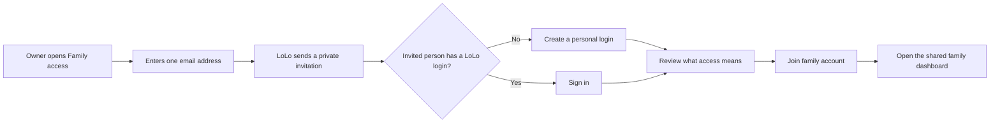

# LoLo Family Account Access Product and Engineering Specification

Status: Proposed

Audience: Product, design, engineering, operations, support

Primary users: Older adults receiving care and trusted relatives helping manage care

## 1. Product decision

LoLo will let multiple trusted people use one shared **family care account** while each person keeps a separate login.

The experience is intentionally simple:

1. The current account holder enters a trusted person's email.
2. LoLo sends an invitation.
3. The invited person creates a login or signs in.
4. They confirm that they want to help manage care.
5. Both people immediately see the same care information.

Users will not share passwords, choose from a permission matrix, create teams, configure workspaces, or understand household tenancy.

Internally, the shared security and data boundary is a `FamilyAccount`. The people who can sign in are `FamilyAccountMember` records. The person receiving care remains a separate concept from the people managing care.

## 2. Product goals

1. A non-technical user can invite a relative without support or training.
2. Every person signs in with their own email and password.
3. Trusted family members see the same requests, caregivers, visits, messages, care history, and action items.
4. The system always records who performed an action.
5. Removing access takes effect immediately without deleting historical actions or care records.
6. Existing family accounts work exactly as they did before deployment.
7. The complete feature can be released in one production deployment with a reversible data migration.

## 3. Non-goals for the first release

- Multiple permission presets or custom permission checklists
- A household or workspace switcher
- Membership in more than one family care account
- Multiple owners or self-service ownership transfer
- Child or minor logins
- Caregiver accounts also acting as family members
- Separate payment methods for different family members
- Expanding the number of saved care-recipient profiles
- Sharing only one request, visit, or conversation
- Public or reusable invitation links

Support may transfer ownership manually after verifying both parties. Broader account switching and granular permissions can be considered later without changing the user-facing invitation model.

## 4. User-facing language

Use:

- Family access
- People with access
- Invite someone
- Help manage care
- Account owner
- Family member
- Invitation sent
- Remove access
- Leave this family account

Avoid:

- Tenant
- Workspace
- Organization
- Seat
- RBAC
- Permission scope
- Household ID
- Collaborator
- Sub-user
- Secondary login

The user-facing feature name is **Family access**. Do not show the internal term `FamilyAccount`.

## 5. Access model

The interface has only two labels. The user does not select one while inviting.

| User-facing label | Who receives it | Capabilities |
| --- | --- | --- |
| Account owner | The existing account holder | All care actions, secure payment-method management, invitations, removals, ownership, and account closure |
| Family member | Anyone invited by the owner | All day-to-day care actions, including the current secure shared payment-method flow and actions that may charge it |

A family member can:

- View and update care and recipient details
- Create, edit, publish, and cancel care requests
- Invite, review, shortlist, and hire caregivers
- Create and manage regular care and continuous coverage
- View, reschedule, skip, or cancel visits when policy permits
- Read and send messages
- Approve hours, request changes, report a problem, and leave reviews
- View billing history and the saved-card summary
- Add or replace the Family payment method through the current secure structured flow
- Open and reply to support requests about shared care
- Change their own profile, password, and notification preferences
- Leave the family care account

A family member cannot:

- Add, resend, or cancel invitations
- Remove another person's access
- Transfer or close the family care account

The owner sees the same operational experience as a family member, plus the owner-only controls.

### Financial disclosure

Invited family members can take operational actions that create or approve charges against the family's saved payment method. Both parties must see this in plain language.

Owner invitation disclosure:

> This person will be able to schedule care, use the secure shared payment-method flow, and approve care-related charges. Only you can invite or remove people, transfer ownership, or close the Family Account.

Invite acceptance disclosure:

> You will be able to schedule care, message caregivers, and approve care-related charges using the family's saved payment method. Your actions will be recorded under your name.

The acceptance action is **Join family account**.

## 6. Primary experience



### 6.1 Family access entry point

Add **Family access** to the family account menu near Account Settings. It opens `/family/access`.

The page heading is **People helping manage care**.

Introductory copy:

> Invite someone you trust to help manage care. They will use their own email and password, and you can remove their access at any time.

The first viewport contains:

1. The account owner
2. Active family members
3. Pending invitations
4. One primary button: **Invite someone**

Do not show an empty permissions table, account identifier, technical role selector, or explanatory modal before the user starts.

### 6.2 Invite someone

Clicking **Invite someone** opens a small page or panel with:

- Label: **Their email address**
- Supporting text: **We will send them a private invitation to help manage care.**
- The financial disclosure from section 5
- Primary action: **Send invitation**
- Secondary action: **Cancel**

This is the entire form. Do not request the person's name, relationship, phone number, or permission level.

On success, return to Family access and show:

> Invitation sent to sarah@example.com.

The pending row shows the email, **Invitation sent**, the expiry date in plain language, and a small **Manage invitation** action.

### 6.3 Invitation email

Subject:

> Charles invited you to help manage care on LoLo

Body:

> Charles has invited you to help manage their family's care on LoLo. You will have your own login and will be able to see visits, message caregivers, and help with care decisions.

Primary action: **Accept invitation**

Footer:

> This private invitation expires in 7 days. If you were not expecting it, you can ignore this email.

Do not include recipient names, diagnoses, care notes, addresses, schedules, caregiver names, or billing information in the invitation email.

### 6.4 Accepting an invitation

The invitation link first validates the token, but does not reveal shared account details before authentication.

If the email does not have a LoLo account, show **Create your login** with:

- Name
- Locked invitation email
- Password
- Password confirmation
- Platform terms acceptance

Possession of a valid single-use invitation verifies the invited email after the user completes registration.

If the email already has an eligible family login, ask the person to sign in. After authentication, show one confirmation screen:

Heading:

> Help Charles manage care

Body:

> You will share access to this family's care requests, visits, caregivers, messages, and care history.

Show the financial disclosure from section 5.

Primary action: **Join family account**

Secondary action: **Not now**

After acceptance, redirect to the shared family dashboard and show:

> You can now help manage care with Charles.

### 6.5 Existing ineligible account

An invitation cannot be accepted automatically when the invited email:

- Belongs to a caregiver, admin, sales, or SDR account
- Is already an active member of another family care account
- Owns a family care account with existing care or billing records
- Does not match the authenticated user's verified email

Show:

> This invitation cannot be joined with your current LoLo account. Contact LoLo Support and we will help you safely connect the accounts.

Do not expose which eligibility condition failed before authentication.

### 6.6 Returning family member

After joining, the family member signs in normally. There is no account picker. The ordinary family dashboard opens with shared data.

The header continues to show the signed-in person's own name. A quiet line on Family access says:

> You are helping manage care with Charles.

The rest of the product should feel like a normal family account. Do not prepend the owner's name to every screen.

## 7. Managing access

### 7.1 Pending invitations

The owner can open **Manage invitation** and choose:

- **Send again**
- **Cancel invitation**

Sending again creates a new token and invalidates every older token for that invitation. Canceling takes effect immediately.

Expired invitations show **Expired** and one action: **Send a new invitation**.

### 7.2 Removing a family member

The owner selects a member and chooses **Remove access**.

Confirmation copy:

> Remove Sarah's access?
>
> Sarah will no longer be able to see this family's care, visits, messages, or billing history. Their past messages and actions will remain in the care record.

Primary action: **Remove Sarah**

Secondary action: **Keep access**

Removal must:

- Take effect on the next request, including existing browser sessions
- Stop future family notifications
- Remove the account from subsequent sign-ins
- Preserve historical messages, approvals, reviews, and audit entries under the member's name
- Not cancel care, visits, payments, or caregiver relationships

The removed user sees:

> Your access to this family account has ended.

Do not reveal current care information on that page.

### 7.3 Leaving an account

A family member can choose **Leave this family account** from their own Account Settings.

Confirmation copy explains that access ends immediately and they must receive a new invitation to return. The account owner cannot leave or remove themselves through self-service.

### 7.4 Ownership

The original family user becomes the account owner during migration. The first release has exactly one owner.

Ownership transfer is support-assisted. Support must verify both people, confirm the destination user is an active member, record the reason, and write an immutable audit entry. A future product release may make this self-service.

## 8. Shared product behavior

### 8.1 Dashboard and action state

All active members see the same underlying requests, caregivers, visits, care plans, coverage plans, and history. Personal presentation state, such as whether a person dismissed a hint, remains personal.

When two members open the same pending action, the first valid submission wins under the existing row-lock or transactional rules. The second person sees a fresh, calm result:

> Sarah already approved these hours. No further action is needed.

Do not show a generic conflict or server error.

### 8.2 Messages

Family members share caregiver conversations. Every message continues to store the real `sender_user_id`.

Caregiver-facing messages show the sender's first name and family context:

> Sarah - Charles's family

Each family member has an independent last-read timestamp. One person reading a conversation must not clear another person's unread indicator.

Removing a member does not remove their messages.

### 8.3 Notifications

Every active member receives in-app notifications for shared care events by default. Email and SMS delivery use each member's own notification preferences and verified contact information.

The initial owner's existing preferences are unchanged. New members begin with:

- Safety and visit-action notifications enabled
- Message notifications enabled
- Marketing notifications disabled

Notifications name the person who acted when helpful:

> Sarah approved the caregiver's hours for Tuesday's visit.

Notification links must authorize membership again when opened. A notification must never preserve access after membership removal.

### 8.4 Billing

Billing belongs to the Family Account, with one Stripe customer and one saved payment-method set.

- Every active Family member can add or replace the payment method through the current secure structured flow.
- Members can view only the safe card brand, last four digits, and expiration summary.
- Removing a saved payment method without replacement remains subject to the current billing UI and support boundaries.
- Members can take disclosed care actions that authorize or capture charges.
- Every payment-affecting action records the acting user.
- Stripe metadata includes both `family_account_id` and the acting `user_id` when available.
- Receipts continue going to the billing owner in the first release.

The UI says **Family payment method**, not the owner's card or the member's card.

### 8.5 Support

All active family members can see and reply to support tickets linked to shared care. Private account-access or payment-method tickets are visible only to the owner and administrators.

Support tooling shows:

- Family Account owner
- Active and removed members
- Pending and expired invitations
- Who performed each relevant action
- Membership audit history
- A protected ownership-transfer action

## 9. Security and privacy requirements

1. Invitation tokens are random, at least 256 bits, stored only as hashes, single-use, and expire after 7 days.
2. An invitation is bound to one normalized email address.
3. Acceptance requires the authenticated and verified email to match the invitation.
4. Resending or canceling invalidates every prior token.
5. Invitations are rate-limited per owner, account, email, and IP address.
6. Owners cannot invite their own email or an existing active member.
7. Membership is checked on every authorized request; session possession alone never grants access.
8. Removing or leaving membership immediately blocks subsequent Livewire actions, controllers, downloads, and notification links.
9. Family-owned records are always scoped by `family_account_id`; client-submitted account IDs are never trusted.
10. Every sensitive membership, billing, hiring, cancellation, approval, and support action records the acting `user_id`.
11. Invitation emails contain no protected care details.
12. Logs must not contain raw invitation tokens, passwords, full payment details, or private care notes.
13. The owner cannot remove the only owner.
14. An administrator can inspect and repair membership but cannot silently impersonate a member through this feature.

## 10. Proposed data model

### 10.1 `family_accounts`

- `id`
- `owner_user_id` - indexed foreign key to users
- `stripe_customer_id` - nullable, indexed, moved from the owner during migration
- `status` - `active` or `closed`
- `created_at`
- `updated_at`

The account does not require a user-editable name in the first release because users cannot switch between accounts.

### 10.2 `family_account_members`

- `id`
- `family_account_id`
- `user_id`
- `access_level` - `owner` or `member`
- `status` - `active`, `left`, or `removed`
- `joined_at`
- `ended_at` - nullable
- `ended_by_user_id` - nullable
- `created_at`
- `updated_at`

Constraints:

- Unique active membership for `(family_account_id, user_id)`
- At most one active Family Account membership per user in the first release
- Exactly one active owner per active Family Account, enforced by service logic and transactional locks

Membership history should be retained rather than hard-deleted.

### 10.3 `family_account_invitations`

- `id`
- `family_account_id`
- `invited_by_user_id`
- `email_normalized`
- `token_hash`
- `expires_at`
- `accepted_at` - nullable
- `accepted_by_user_id` - nullable
- `canceled_at` - nullable
- `canceled_by_user_id` - nullable
- `created_at`
- `updated_at`

Only one usable invitation may exist for one account/email pair. Historical rows may remain for audit.

### 10.4 `family_conversation_reads`

- `care_request_conversation_id`
- `user_id`
- `last_read_at` - nullable
- timestamps

Unique key: `(care_request_conversation_id, user_id)`.

The existing caregiver read state may remain on `care_request_conversations`. The existing `family_last_read_at` remains populated for backward compatibility but is no longer the source of truth for family unread state.

### 10.5 `family_account_activity_logs`

- `id`
- `family_account_id`
- `actor_user_id` - nullable only for automated migration/system actions
- `action`
- `subject_user_id` - nullable
- `metadata` - privacy-minimized JSON
- `created_at`

Required membership actions include invitation sent, resent, canceled, accepted, member removed, member left, and ownership transferred.

### 10.6 Family-owned records

Every table that currently treats `family_user_id` as its access boundary must receive an indexed `family_account_id`. This includes at least:

- Family household and recipient profiles
- Care requests and AI request sessions
- Care request invitations and conversations
- Favorites
- Care relationships and care plans
- Care bookings and booking payments
- Continuous coverage plans
- Completed extra-visit requests
- Family-side time corrections and other family approval records

Child records may authorize through a required parent only when the relationship is unambiguous and efficiently queryable. High-volume root queries should carry `family_account_id` directly.

Existing `family_user_id` columns remain in place. New writes set them to the Family Account owner's user ID for rollback compatibility. The actual human actor is stored in the relevant actor or requester field.

## 11. Application architecture

### 11.1 Central account context

Add a single service responsible for resolving family access, for example `FamilyAccountContext`:

- Resolve the signed-in user's active Family Account
- Return the active membership
- Determine owner-only capabilities
- Scope queries to the account
- Reject missing, removed, left, closed, or conflicting memberships

Controllers and Livewire components must not recreate membership rules locally.

### 11.2 Authorization

Replace direct comparisons such as:

```php
$record->family_user_id === auth()->id()
```

with policies that compare the record's Family Account to the authenticated user's active membership.

Policies remain the final authorization boundary even when a query was already scoped. Route model binding must not make a cross-account record accessible.

Owner-only abilities include:

- `manageFamilyMembers`
- `manageFamilyPaymentMethod`
- `closeFamilyAccount`

Operational family abilities use active membership and the existing record-state rules.

### 11.3 Querying

Replace `where('family_user_id', auth()->id())` in family dashboards, requests, plans, visits, histories, conversations, support, and notification builders with account-aware scopes.

Required conventions:

- `forFamilyAccount($account)` model scopes for root records
- No client-provided `family_account_id` in validated form input
- Creation services inject the resolved account and legacy owner ID
- Background commands operate on stored `family_account_id`, not the currently authenticated user

### 11.4 Audit attribution

Existing actor fields, including message sender, cancellation actor, requester, approver, and event actor, must use the actual signed-in user.

Add actor fields where a sensitive action currently relies only on `family_user_id` or timestamps. Existing historical rows may attribute the owner during backfill only when the original actor cannot be recovered.

## 12. Existing-account migration

The migration is additive and runs while the application is in maintenance mode.

For every existing family-role user:

1. Create one active Family Account.
2. Create one active owner membership.
3. Move the user's `stripe_customer_id` to the Family Account while retaining it on the user.
4. Attach the user's family household and recipient profiles.
5. Backfill every family-owned record from `family_user_id` to the new account.
6. Create an audit entry identifying the automated migration.

The backfill must be deterministic and idempotent. Rerunning it cannot create duplicate accounts, memberships, or mappings.

### Required migration invariants

Before maintenance mode ends:

- Every existing family user has exactly one active owner membership.
- Every active Family Account has exactly one active owner.
- Every family-owned production record has a valid `family_account_id`.
- Every backfilled record's legacy `family_user_id` matches the account owner.
- No user has active membership in more than one Family Account.
- Stripe customer IDs are not assigned to multiple Family Accounts.
- Counts and financial totals before and after migration match.
- No caregiver, admin, sales, or SDR user was made a family member.

If any invariant fails, the deployment fails and the application remains in maintenance mode.

## 13. One-deployment release procedure

This feature is released to everyone in one deployment. It does not require a progressive user rollout or feature flag.

### Before production deployment

1. Run the full automated suite in CI.
2. Rehearse the complete migration against a recent sanitized production clone.
3. Record migration time, row counts, validation output, and expected disk requirements.
4. Confirm the rollback commit and commands.
5. Schedule a maintenance window based on the rehearsed migration time.

### Production sequence

1. Stop scheduled deployments and take a recoverable database snapshot.
2. Enter maintenance mode.
3. Stop or drain queue workers and scheduled commands that write family-owned data.
4. Pull the release and install dependencies.
5. Build production assets.
6. Run additive schema migrations and the idempotent backfill.
7. Run `homecare:verify-family-accounts` and store its output with the deployment record.
8. Run focused authenticated smoke tests for existing owner access, cross-account denial, payments, messages, and invitations.
9. Cache configuration, routes, and views.
10. Restart workers and PHP-FPM.
11. Run application and voice-agent health checks.
12. Leave maintenance mode only after every verification passes.

The current deployment cleanup behavior must not automatically bring the application up after a failed migration or failed family-account verification. Failure must leave maintenance mode in place for deliberate rollback or repair.

### Rollback compatibility

The release keeps and continues populating legacy ownership fields. If application code must be rolled back:

- Existing owners retain access through their original `family_user_id` records.
- Records created by a member still use the owner as legacy `family_user_id`.
- Actual member attribution remains stored for later recovery.
- Additive Family Account tables and columns may remain in place.
- Invited members temporarily lose shared access under the old code, but no care or financial data is lost.

Do not attempt destructive down migrations during an emergency rollback.

## 14. Error and edge-case behavior

| Situation | User experience |
| --- | --- |
| Owner invites an existing member | “This person already has access.” |
| Owner invites their own email | “You already have access to this account.” |
| Invitation expired | “This invitation has expired. Ask the account owner to send a new one.” |
| Invitation canceled or already used | “This invitation is no longer available.” |
| Signed-in email does not match | “Sign in with the email address that received this invitation.” |
| Member was removed while a page was open | Stop the action and show “Your access to this family account has ended.” |
| Another member already completed an action | Name the completed action and refresh the current state |
| Owner attempts to remove themselves | Explain that LoLo Support can help transfer ownership |
| Payment method is missing | Preserve the care action and guide the active Family member to add a Family payment method through the secure flow |
| Invitation email delivery fails | Keep the invitation pending, show a retry action, and alert support after repeated failure |

Errors never expose whether an unrelated email has a LoLo account before authentication.

## 15. Accessibility and usability requirements

- One primary action per screen or panel
- No role dropdown in the invitation flow
- No more than one form field to send an invitation
- At least 16px input text and 44px touch targets
- Plain-language confirmation for access removal and financial capability
- Status never communicated by color alone
- Keyboard and screen-reader access to all invitation and removal actions
- Focus moves to the confirmation heading when a dialog opens and returns to the triggering control when it closes
- Success and error status uses an `aria-live` region
- Email addresses may wrap without horizontal scrolling
- Mobile cards stack; no wide member-management table
- Dates use an unambiguous friendly form such as “August 13, 2026”
- The invitation and acceptance flows work without requiring the user to understand browser tabs or copy tokens

## 16. Acceptance criteria

### Existing family owner

- After deployment, an existing family user sees all prior care data with no manual action.
- Their dashboard, messages, requests, visits, history, favorites, billing, and support access remain unchanged.
- They appear as **Account owner** on Family access.
- Their existing Stripe payment method and notification preferences remain available.

### Invitation

- The owner can send an invitation by entering only an email address.
- The invitation contains no private care information.
- The token is hashed, single-use, email-bound, and expires in 7 days.
- Resend invalidates the old link.
- Cancel immediately invalidates the invitation.
- A non-owner cannot access invitation-management actions by UI, Livewire call, or direct HTTP request.

### Acceptance

- A new user can create a login and join without a separate email-verification loop.
- An eligible existing user can sign in and join.
- The user must affirm the operational and financial disclosure.
- An ineligible or mismatched account cannot join.
- Acceptance is transactional and cannot produce a user without membership or membership without an audit record.

### Shared access

- Owner and member see the same family-owned care records.
- Both can complete every allowed operational action.
- The actual person is recorded on messages, approvals, requests, cancellations, reviews, and payment-affecting actions.
- One person's conversation read state does not change the other's.
- Concurrent actions resolve safely with a friendly already-completed message.

### Isolation

- A member cannot access another Family Account by URL, ID substitution, Livewire payload, download route, notification link, or API request.
- Pending, canceled, expired, removed, and left memberships grant no access.
- Removing a member blocks the next request from an already-open browser tab.

### Billing

- Existing Stripe customers map to exactly one Family Account.
- Every active Family member can use the current secure shared payment-method flow; invitation, removal, ownership, and closure controls remain owner-only.
- Members can perform disclosed care actions using the saved family payment method.
- Every such action records the member and account IDs.
- Payment totals and ledger relationships are unchanged by migration.

### Deployment

- The migration is successfully rehearsed on a recent production clone.
- Verification proves every family-owned record is mapped.
- A verification failure leaves production in maintenance mode.
- Rolling application code back preserves owner access and all records.

## 17. Required automated coverage

### Unit and service tests

- Membership resolution for owner, member, removed member, and no membership
- Owner-only capability checks
- Invitation state transitions and token validation
- Idempotent account backfill
- Account-scoped query helpers
- Per-member notification recipient selection

### Authorization tests

For every family-owned resource type:

- Owner allowed
- Active member allowed for operational actions
- Member denied owner-only actions
- Unrelated family user denied
- Removed member denied
- Caregiver behavior unchanged
- Administrator behavior unchanged where explicitly supported

### Feature tests

- Send, resend, cancel, expire, register through, sign in through, accept, leave, and remove
- Existing owner dashboard and every family index/detail screen
- One-time request creation and hiring
- Regular-care creation and management
- Continuous-coverage creation and management
- Messaging and independent unread state
- Visit reschedule, cancellation, hours approval, correction, review, and support
- Billing visibility and payment-method authorization
- Notification fan-out and revoked-member suppression
- Ownership support workflow

### End-to-end tests

1. Owner invites a new family member.
2. Member creates a login and joins.
3. Both see the same request and visit.
4. Member messages the caregiver and the caregiver sees the member's name.
5. Member approves hours; owner sees who approved them.
6. Owner removes the member while the member has a page open.
7. The member's next action is rejected and future sign-in shows no family data.
8. Existing single-user family flow passes without using Family access.
9. Direct cross-account URL and Livewire tampering are denied.

## 18. Operational metrics and support signals

Track:

- Invitations sent, delivered, accepted, expired, canceled, and failed
- Time from invitation to acceptance
- Active Family Accounts with more than one member
- Access removals and voluntary departures
- Authorization denials involving inactive membership
- Duplicate or conflicting operational actions
- Support contacts from invitation eligibility failures
- Payment actions performed by a non-owner member

Alerts:

- Family-account verification failure during deployment
- A family-owned record without `family_account_id`
- More than one active owner or active account membership for one user
- Repeated invitation delivery failures
- A removed member passing an authorization check
- Stripe customer associated with more than one Family Account

## 19. Final UX checklist

The feature is ready only when all answers are yes:

- Can the owner invite someone by entering one email and pressing one button?
- Is it clear that the invited person uses their own password?
- Is it clear that the invited person can schedule care and approve charges?
- Can the invited person join without understanding accounts, roles, or workspaces?
- Does the ordinary dashboard work without an account switcher?
- Can either person tell who sent a message or approved an action?
- Can the owner remove access with a clear explanation of what changes?
- Does removal work immediately on an already-open page?
- Does every old family account still work without setup after deployment?
- Can the release be rolled back without deleting or rewriting care and payment history?
