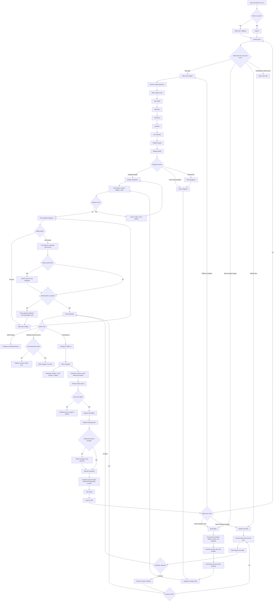

# Care Receiver Side Workflow

This map is the family / care receiver journey for posting care, hiring, payment protection, visit management, approval, and rebooking.

## Button Rules

- One primary action per screen section: the button should match the next real decision.
- Risky actions stay behind a clear disclosure, such as "Need to stop this request?"
- Payment actions say exactly what will happen: pre-authorize, confirm authorization, approve timesheet, capture payment.
- Rebooking should never ask the user to start over. It should reuse caregiver, recipient, address, care tasks, and only ask for the next schedule.
- Older users should see plain verbs: Start care, Review caregivers, Hire Caroline, Open visit, Review hours, Book Caroline again.
