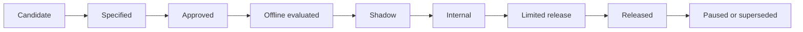

# Capability and Risk Framework

Status: Proposed

Last reviewed: August 13, 2026

Owner: Product

Required approvers: Product and engineering for all capabilities; security/privacy and support operations for Classes D and E

## Why capabilities are the unit of release

An agent is too broad to approve as one feature. LoLo approves individual user outcomes. A capability is a bounded promise such as “open my next visit,” “prepare a one-time care request,” or “explain why a request is still waiting.”

Each capability has its own users, facts, tools, risks, evaluations, feature flag, and rollout state. A capability may be released for family owners while remaining unsupported for caregivers or signed-out users.

## Role-separated capability tracks

Family/care-receiver and caregiver support share the conversation platform and human-support inbox, but not a generic capability set.

- Family/care-receiver capabilities cover finding and arranging care, care recipients, requests, caregivers, visits, messages, hours review, billing navigation, and family-account help within family authorization.
- Caregiver capabilities cover onboarding/profile tasks, verification, invitations, finding and applying to work, scheduled shifts, check-in/out guidance, submitted hours, earnings, payouts, messages, and caregiver support within caregiver authorization.
- The authenticated server role selects which KB entries, navigation targets, tools, and record context can be exposed.
- A model may not switch a user into another role track because of conversational wording.
- If an account/role is ambiguous or unsupported, the agent asks a safe clarification or escalates without revealing other-role data.

Every shared-looking intent, such as “open my messages” or “what do I do next?”, still requires role-specific routing and evaluation.

## Capability identifiers

Use stable uppercase identifiers:

`{DOMAIN}-{OUTCOME}-{NUMBER}`

Examples:

- `SUP-ANSWER-001`
- `NAV-REQUEST-001`
- `CARE-REQUEST-001`
- `VISIT-CHANGE-001`

Identifiers are never reused. Superseded capabilities retain their ID and link to their replacement.

## Risk and autonomy classes

| Class | Name | Agent authority | Confirmation | Examples |
| --- | --- | --- | --- | --- |
| A | Explain | Answer only from approved, applicable sources | None | Explain a status; explain where messages are |
| B | Navigate | Offer and perform an approved internal navigation or highlight | User presses a clear navigation action unless already explicitly requested | Open Care hub; highlight **Message caregiver** |
| C | Prepare | Read authorized data, ask for missing facts, and create or update a reversible draft | User reviews the draft before any external effect | Prepare a care-request draft |
| D | Execute | Perform a bounded side effect through an approved domain service | Explicit, action-specific confirmation immediately before commit | Publish a one-time care request |
| E | Sensitive/restricted | Explain, route, or escalate; execution is prohibited until separately approved | Human-led by default | Payment methods, disputes, family access, medical issues |

Risk is based on impact, not technical difficulty. Opening a page is Class B even if navigation is complex. A one-click cancellation can be Class E even if implementation is simple.

## Confirmation rules

### Class A

No confirmation is required. The answer must have an applicable approved source or the agent must escalate or state the limitation.

### Class B

If the user says “take me there,” the agent may navigate after acknowledging the destination. If the user only asks where something is, present a **Take me there** action rather than moving unexpectedly. Navigation never implies completion of the underlying task.

### Class C

The agent may collect and prefill data. The user must see the draft in an ordinary editable product surface or a complete plain-language preview. Saving a private draft may occur without a commit confirmation only when the capability explicitly defines that draft as reversible and non-notifying.

### Class D

The application must render a deterministic preview generated from validated server data. The user confirms with an action-specific control such as **Create this care request**. Conversational phrases such as “okay,” “sure,” or “yes” are not sufficient unless the capability specification explicitly defines and tests conversational confirmation and the server binds it to the exact preview version.

The confirmation is invalid if any material preview field changes, the authorization context changes, the relevant record version changes, or the confirmation expires.

### Class E

The initial intelligent agent may explain the normal workflow, navigate to an approved structured form, or transfer to a human. It may not execute the sensitive action.

## Capability lifecycle

Progression is not automatic. Each transition requires the evidence named in [rollout and release gates](07-rollout-and-release-gates.md).

## Required capability specification

Every capability must use the [capability template](templates/capability-spec-template.md) and define:

- User outcome and user-facing promise
- Supported and excluded roles
- Eligible account and resource states
- Risk class and rationale
- Trigger examples and confusing near-neighbors
- Required authorized context
- Approved knowledge sources
- Allowed navigation targets and tools
- Required and optional fields
- Clarification behavior
- Preview and confirmation copy
- Deterministic success result and receipt
- Failure behavior and escalation conditions
- Privacy and retention impact
- Event and cost attribution requirements
- Evaluation IDs and release thresholds
- Feature flag and rollback behavior

No implementation should infer missing product decisions from a generic system prompt.

## Capability promotion checklist

### Candidate to specified

- Evidence of user need exists.
- A product owner is named.
- The outcome is narrow enough to test.
- Unsupported neighboring intents are explicit.

### Specified to approved

- Domain and authorization owners agree.
- Risk class and confirmation are accepted.
- Knowledge and tool sources are named.
- Safety and handoff behavior are complete.
- Evaluation cases exist.

### Approved to shadow

This generic lifecycle state is not used by the current LoLo program. `DEC-047` skips production-conversation shadowing; capabilities move from approved offline/staff-account evidence to exact-user limited release only after their declared gates pass.

- Deterministic tests pass.
- Offline agent gates pass across repeated runs.
- Event logging and admin review work.
- The agent produces no user-visible reply or side effect.

### Shadow to limited release

- Support review shows acceptable proposed decisions on real traffic.
- No unresolved critical failures exist.
- Human takeover and kill switches have been exercised.
- The cohort, duration, and rollback owner are named.

### Limited to released

- Production quality, safety, usability, latency, and cost gates pass.
- Older-adult usability requirements pass when applicable.
- Support operations accepts the workload and failure profile.
- The capability registry and KB review dates are current.

## Capability dependencies

A higher-class capability depends on the lower layers it uses. For example, publishing a care request depends on:

- Correct identity and family context
- Correct request-intent routing
- Correct collection and normalization
- Correct task and schedule validation
- A complete preview
- An action-specific confirmation
- Idempotent publication
- A truthful result receipt
- Human escalation when any dependency fails

If a dependency is paused, every dependent capability must automatically downgrade or disable.

## Supported, unsupported, and unknown responses

The agent must distinguish:

- **Supported:** The capability is released for this user and state.
- **Unavailable in this state:** The capability exists, but the current authorization or record state prevents it.
- **Not yet supported:** LoLo has not released the capability.
- **Unknown:** The system lacks authoritative information or cannot determine the user's intent safely.

“Unknown” is a valid outcome. It should lead to a concise limitation and human handoff, not a best guess.

## Change control

Any change to action class, required confirmation, authorized roles, writable fields, domain service, KB source, or escalation behavior is a material capability change. Return the capability to at least **Approved**, rerun its complete evaluation slice, and repeat staff-account or limited-release evidence when the risk materially increases.
