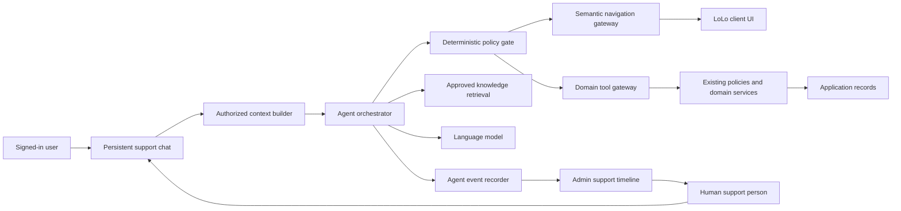

# System Architecture

Status: Proposed target architecture

Last reviewed: August 13, 2026

Owner: Engineering

Required approvers: Engineering, security/privacy, product

## Architectural decision

Build a controlled orchestration layer around LoLo's existing support and domain services. Do not give the model arbitrary database access, raw browser control, or the full page DOM.

## Boundary of responsibility

### The model may

- Interpret the user's natural-language goal.
- Extract candidate structured fields.
- Select among tools exposed for the current capability.
- Ask a concise clarification.
- Turn authoritative results into plain language.
- Produce a handoff summary from observable conversation events.

### The model may not

- Decide authorization.
- Query unrestricted application data.
- Create raw database records.
- Invent route names, DOM selectors, tool names, or tool fields.
- Bypass previews or confirmation.
- Treat its own earlier statement as authoritative application state.
- Claim a write succeeded before receiving a successful tool receipt.
- Continue public replies after a human has claimed the conversation.

### The application must

- Resolve the authenticated user and current family account.
- Filter context and tools by role, capability, and state.
- Apply existing policies inside every read and write service.
- Validate and normalize all tool arguments.
- Generate deterministic previews for material actions.
- Bind confirmation to a preview, actor, action, and expiry.
- Make writes transactional and idempotent.
- Record observable events and authoritative results.

## Core components

### Persistent chat surface

Extend the existing support chat rather than creating a second support conversation. The chat must survive allowed Livewire navigation, preserve drafts, show whether automation or a person is replying, and retain **Talk to a person**.

The design must preserve the mobile and accessibility requirements in [the live-chat specification](../support-live-chat-spec.md).

For every live user without an active pilot grant, render the existing human-support experience unchanged. Do not render an AI entry point, disclosure, greeting, suggestion, or disabled placeholder. Do not rely on hidden client controls: AI endpoints and orchestration must independently reject ineligible users without calling a model.

### Pilot eligibility gate

Before retrieval, model invocation, or tool exposure, the server evaluates:

1. Environment and production AI master controls are on.
2. User-visible AI replies are on.
3. The exact authenticated user has an active, unexpired pilot grant.
4. The user's current server-derived role is allowed by the grant and capability.
5. The requested capability and any required tool are enabled.
6. The conversation is still automated and is not in human-only mode.

Every condition is required. Missing, stale, unreadable, or contradictory state fails closed to ordinary human support. A grant is bound to a user ID, not inherited through a family account, and never replaces normal record authorization.

### Authorized context builder

Build a small structured envelope for each turn. The authenticated server role is resolved before retrieval or tool exposure; the model never chooses or changes the role track. Include only what the current role and capability need:

- Stable conversation and user identifiers
- User role and active family-membership attributes
- Locale, timezone, and declared accessibility preferences when available
- Current normalized route and semantic screen identifier
- Authorized resource identifiers relevant to the page
- Capability states and feature flags
- Active pilot-grant ID and allowed scope
- Human/agent ownership state
- Pending draft or confirmation reference

Do not send arbitrary page text, browser storage, hidden fields, query-string secrets, full account histories, or unrelated care notes.

### Agent orchestrator

The orchestrator owns turn state, role-aware capability routing, knowledge retrieval, model calls, tool proposals, and handoff. It must be deterministic about which policy gate is invoked and record all externally observable decisions.

It should expose only the smallest tool set necessary for the authenticated role and selected capability. A generic “operate LoLo” tool is prohibited. Family/care-receiver tools cannot be exposed in caregiver turns, and caregiver tools cannot be exposed in family turns.

### Deterministic policy gate

The policy gate checks:

- Capability release state
- Exact-user pilot eligibility
- User and family authorization
- Resource state and version
- Risk class
- Required confirmation
- Allowed tool and fields
- Rate and retry limits
- Human takeover state
- Safety or escalation flags

The gate returns allow, deny, request-confirmation, or escalate with a stable reason code. The model cannot override it.

### Admin control plane

The authenticated admin application owns pilot grants, global/capability controls, KB lifecycle operations, and access to conversation evidence. Administrative mutations require explicit permissions, server validation, audit events, and conflict-safe writes. The target behavior and permission boundaries are specified in [Admin control plane, pilot access, and KB workspace](11-admin-control-plane-and-pilot.md).

### Knowledge retrieval

Retrieval filters by entry status, user role, product area, route, jurisdiction when applicable, effective dates, and product version. Answers must record the entry IDs and versions used.

When no applicable approved entry is found, the orchestrator must not ask the model to answer from general knowledge.

### Semantic navigation gateway

Navigation uses a versioned registry, not visual coordinates. A target declares:

- Stable target ID
- Route name and allowed parameters
- Supported roles
- Optional resource policy
- Client semantic element ID for highlighting
- Expected arrival signal
- Safe fallback destination

The client confirms navigation and target availability. If the target is missing because the UI changed, the agent explains that it could not show the location and offers the safe destination or human help.

The model never receives or emits arbitrary CSS selectors.

### Domain tool gateway

Each tool wraps an existing application service or a new narrowly scoped application service. A tool contract includes:

- Tool and capability IDs
- Read or write classification
- Input schema and field constraints
- Output and error schema
- Required policies
- Preview behavior
- Confirmation class
- Idempotency key behavior
- Audit event behavior
- Timeout and retry rules

Prefer a three-stage action lifecycle for Class D:

1. **Prepare:** collect and normalize candidate data.
2. **Validate/preview:** resolve current authoritative state and return a preview hash.
3. **Commit:** require the exact preview confirmation and return a receipt.

### Event recorder and admin timeline

Record user messages, assistant messages, capability decisions, KB sources, navigation proposals/results, tool proposals/results, previews, confirmations, failures, transfers to human support, human claims, and human replies.

Do not record private chain-of-thought. Record concise reason codes and evidence references that support operational review.

### Human takeover controller

The existing support conversation remains canonical. When a user or deterministic policy transfers the conversation to human support:

- The server atomically records the transfer, emits the one-time deterministic transfer confirmation, and changes the public responder mode to human-only.
- The agent stops public replies immediately after that confirmation, whether or not a specific administrator has claimed the conversation.
- In-flight writes are allowed to finish only if already validly confirmed; otherwise they are cancelled or expire safely.
- The administrator sees a concise generated summary plus the exact transcript and events.
- The user sees that the conversation was sent to LoLo Support, without queue position, queue-status messages, or invented timing.
- A human may return the conversation to automation only through a deliberate admin action and a user-visible notice.

Administrator claim remains the internal assignment authority and must be atomic, but it is not the cutoff for automation; transfer is.

## Conversation and event model

The future design should preserve one user-facing support conversation while allowing structured agent substate. A conceptual relationship is:

- Support ticket: canonical conversation, ownership, status, and retention boundary.
- Support messages: user, assistant, and administrator public messages; private admin notes remain separate.
- Agent run/turn: model/configuration version, prompt version, capability, KB IDs/versions, latency, tokens, and outcome metadata; never a persisted duplicate of the complete assembled request.
- Agent event: normalized observable action timeline.
- Agent draft: capability-specific reversible state.
- Action preview/confirmation: immutable binding for a proposed Class D commit.
- Tool receipt: authoritative result or stable failure.

The exact schema is an implementation decision, but it must support independent audit, retention, and deterministic reconstruction from authorized canonical records and version references without parsing prose. Historical reconstruction must not require persisting a second complete prompt, copied transcript, or retrieved-KB payload.

## Failure behavior

The agent must fail closed for authorization, confirmation, schema, safety, and state-version errors. It may fail open only by falling back to human support or a clearly safe manual destination.

| Failure | Required behavior |
| --- | --- |
| Model timeout or invalid output | No write; use a deterministic safe response or human handoff |
| KB retrieval has no approved result | State limitation; offer human help |
| Navigation target missing | Do not guess; open safe parent page or escalate |
| Authorization denied | Do not reveal resource existence; provide generic allowed next step |
| Preview changed | Invalidate confirmation and show the updated preview |
| Commit timed out | Query by idempotency key before retrying or claiming failure |
| Tool validation failed | Preserve the draft, name the correctable field, and do not commit |
| Conversation transfers to human support | Emit only the deterministic transfer confirmation, then stop automated public replies |

## Legacy-component retirement

The current `AiCopilot` feature is legacy and must be removed under `DEC-005`. Do not connect, migrate, wrap, or incrementally evolve it into the support widget.

The target support agent is implemented from the approved capability, context, tool, event, KB, safety, and evaluation contracts in this directory. It may call ordinary, non-AI LoLo domain services after those services pass the new tool and authorization requirements. It must not depend on legacy copilot sessions, prompts, responders, quality scores, or publication orchestration.

Under `DEC-011`, historical legacy sessions, messages, and identifiable or content-bearing derivatives are permanently deleted and never migrated into the target architecture. Valid published `CareRequest` records and ordinary human-support records are preserved. Remove the legacy tables through new follow-up migrations after deletion preflight and write shutdown; do not destructively rewrite deployed migration history.

## Model/provider abstraction

Product behavior must not depend on undocumented traits of one model. The model adapter records exact model identity and supports controlled comparison. Model selection is defined in [operations and cost](08-observability-operations-and-cost.md).

Official OpenAI documentation currently lists Responses API, function calling, and structured outputs as supported for GPT-5.6 Sol. Treat those as implementation capabilities, not substitutes for LoLo's deterministic policy and domain layers: [GPT-5.6 Sol model documentation](https://developers.openai.com/api/docs/models/gpt-5.6-sol).
