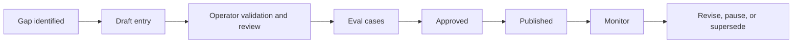

# Knowledge-Base Governance

Status: Proposed

Last reviewed: August 13, 2026

Owner: Product content

Authorized KB operators: LoLo's two designated team members; under `DEC-022`, either may complete the full lifecycle alone

## Purpose

The knowledge base is the agent's approved source of product truth. It is not a dump of documents, support conversations, or application pages. Each entry is a small, versioned, reviewable unit with explicit applicability and an expiration or review date.

The KB supports four different jobs. They must not be blended into one generic article.

## Entry types

| Type | Purpose | Example |
| --- | --- | --- |
| Product fact | Explain a product rule or state | Who can change the family payment method |
| Task playbook | Guide a supported user outcome | How to create a one-time care request |
| Navigation entry | Map a goal to an approved semantic target | Open care-request history |
| Escalation playbook | Define when and how a person takes over | Billing dispute or immediate-danger language |

An entry may link to other entries, but each has one primary purpose and owner.

## Required entry metadata

Every entry must contain:

- Stable KB ID
- Type
- Status
- Owner and optional reviewer/subject-matter contact
- User roles and account states
- Product area and relevant route/screen IDs
- Effective date and review-by date
- Approved source IDs from the [source register](registries/source-register.md)
- Plain-language answer or procedure
- Facts the agent may state
- Facts the agent must not infer
- Related capability IDs
- Escalation conditions
- Sensitivity classification
- Version and change notes
- Evaluation IDs that prove retrieval and answer behavior

Use the [knowledge entry template](templates/knowledge-entry-template.md).

## Source authority

### Approved sources

An approved product specification, policy, verified application contract, or signed decision may support a KB entry. “The UI currently says this” is insufficient for a durable policy answer unless the product owner confirms it.

### Discovery-only sources

The following may identify questions or wording but may not directly authorize an answer:

- Support tickets and chat transcripts
- Search logs
- Analytics
- Sales or operations notes
- Old screenshots
- Model-generated summaries
- Unapproved draft specifications

### Conflicts

If approved sources conflict:

1. Mark the affected entry **Paused**.
2. Prevent the agent from answering that topic as authoritative.
3. Open a decision-log item naming both sources.
4. Route users to the safe structured workflow or human support until resolved.

## Writing rules for older users

- Lead with the answer or next action.
- Use familiar verbs: **Start care**, **Open visit**, **Message caregiver**, **Review hours**.
- Explain one decision at a time.
- Avoid internal statuses, acronyms, and legal or payment jargon unless essential.
- State exact consequences for payment-affecting or irreversible actions.
- Use concrete dates and times when resolving relative language.
- Do not use reassurance as a substitute for facts.
- Never imply that a caregiver is guaranteed, a payment succeeded, or support is online without authoritative state.

## Retrieval contract

Retrieval must filter before semantic ranking. At minimum:

1. Status is **Approved** or **Released**.
2. Current date falls within effective/review rules.
3. Entry applies to the user's role and account state.
4. Entry applies to the product area or capability.
5. Sensitivity policy allows the entry for this context.
6. Linked sources are not superseded or paused.

Semantic similarity alone must never select an inapplicable role, outdated policy, or neighboring workflow.

Family/care-receiver and caregiver entries must declare their roles explicitly. Similar terms such as “request,” “visit,” “hours,” “payment,” and “messages” can mean different things for the two sides and require role-specific facts and next actions.

The agent response records the KB IDs and versions used. Administrators should be able to open those entries from the conversation timeline. The user interface may show a concise source link when it aids trust, but the user should not be burdened with internal citations for routine navigation.

## Answer construction

For a factual product answer, the model receives only the relevant entry text and the minimum authorized context. The answer must:

- Preserve the entry's conditions and material caveats.
- Avoid adding external or general-knowledge claims.
- Say when the entry does not cover the user's situation.
- Offer the next approved action or human handoff.

Where exact wording matters, use deterministic response templates rather than model paraphrase.

## Content lifecycle

Retention follows `DEC-030`. A never-released version with no protected dependency may be permanently deleted immediately through the authorized workflow. A released version remains in full while published/paused and for 36 calendar months after final retirement, extended only until retained dependencies expire. Its content is then deleted and a content-free tombstone remains for 24 additional months before deletion/de-identification. Stable KB IDs are never reused.

### Creation

New entries begin from a named source and user need. The writer adds evaluation examples before approval.

### Admin KB workspace

The admin UI is the operational system for KB management. Authorized administrators can:

- List and search all entries and versions, including Draft, In review, Approved, Published, Paused, Superseded, and deleted/archived tombstones.
- Filter by status, role, product area, type, sensitivity, owner, optional reviewer/contact, source, review date, capability, and route/semantic target.
- Create a new entry as **Draft**; drafts are never retrievable by the customer-facing agent.
- Edit a draft, validate required metadata, preview the plain-language answer, and attach source and evaluation references.
- Submit for review, approve when authorized, publish an immutable version, pause it immediately, or supersede it with a new version.
- See which conversations, capabilities, routes, tools, and evaluations reference a particular version.
- Open the exact entry and version used by an agent turn from the conversation timeline.
- Delete a never-released, dependency-free draft after explicit confirmation.
- Delete a released entry from active use by withdrawing it immediately and starting the bounded historical-retention lifecycle. Released versions and usage evidence are not silently erased by the normal UI; full content and the later content-free tombstone expire under `DEC-030`.

Create, edit, self-review, approve, publish, pause, supersede, and delete actions record the administrator, time, reason, prior version, and result. Under `DEC-022`, either designated KB operator may perform the full lifecycle alone, including authoring and publishing the same entry and handling sensitive content. The same-person workflow does not bypass authoritative sources, validation, evaluations, versioning, confirmation, or audit. A second person may review voluntarily but is never a normal workflow dependency.

No entry is published directly from a model suggestion, transcript, bulk import, or unapproved source. Those inputs can create a draft or review task only.

### Review

High-change or high-risk content receives a shorter review period. Suggested starting cadence:

- Safety, billing, family access, cancellation, and disputes: review at least every 90 days and on any related product change.
- Core care workflows: review at least every 180 days and on any related release.
- Stable navigation/help content: review at least every 180 days, plus automated route/target validation.

These are initial governance targets, not legal retention requirements.

### Publication timing

Under `DEC-023`, the first release supports manual **Publish now** only. A future effective date blocks publication; the version remains draft or approved until an operator publishes it at the intended time. Review-by and expiration dates continue to control ongoing eligibility and review.

### Product-change coupling

A product change is incomplete until it assesses:

- Affected KB entries
- Navigation targets
- Capabilities and tool schemas
- Evaluation cases
- User-facing confirmation or escalation language

CI should eventually fail when a removed route or semantic target remains in an approved KB or navigation entry.

### Support-feedback loop

Support may mark a conversation as:

- Missing KB content
- Outdated content
- Confusing answer
- Wrong applicability
- Unsupported capability request

Automated analysis may also categorize, cluster, and risk-sample conversations to find repeated questions, user corrections, confusing experiences, and likely content gaps. Sensitive transcript data must be minimized, and transcript access and review actions must be restricted and auditable.

These signals create review tasks. They do not automatically edit the KB or authorize an answer. A proposed change must be verified by an authorized KB operator against an authoritative source, pass applicable risk checks, be published as a versioned KB entry, and create or update a regression evaluation. The author may complete those steps alone under `DEC-022`.

Medical, safety, legal, payment, identity, and account-permission instructions may never be learned directly from transcript content or a prior support answer.

## KB quality tests

Test the KB independently from the language model:

- Required metadata is present.
- Source IDs exist and are active.
- Review dates are current.
- Roles and states are valid enumerations.
- Route and semantic-target IDs resolve.
- No active entries contradict for the same applicability set.
- Sensitive entries have the required classification, checks, and an authorized operator's recorded self-review/approval.
- Related evaluation IDs exist.

Then test retrieval and answer behavior:

- Correct entry retrieved for realistic wording.
- Neighboring but incorrect entry rejected.
- Role-inappropriate entry rejected.
- Expired or paused entry rejected.
- No-result case escalates safely.
- Answer preserves required conditions.

## Initial KB build order

1. Human escalation, support availability, and emergency limitation.
2. Family roles, shared-care access, and owner-only controls.
3. Care-request creation fields and lifecycle.
4. Care-request status and next steps.
5. Messages and notifications.
6. Visit navigation and common visit states.
7. Caregiver-facing help only after family-user scope is stable.

## Ownership dashboard

The KB operations view should show:

- Entries due for review
- Paused or conflicting entries
- Entries with high escalation or correction rates
- Retrieval misses by user intent
- Capabilities blocked by missing content
- Product changes with unresolved KB impact
- Entry owner and last approver
