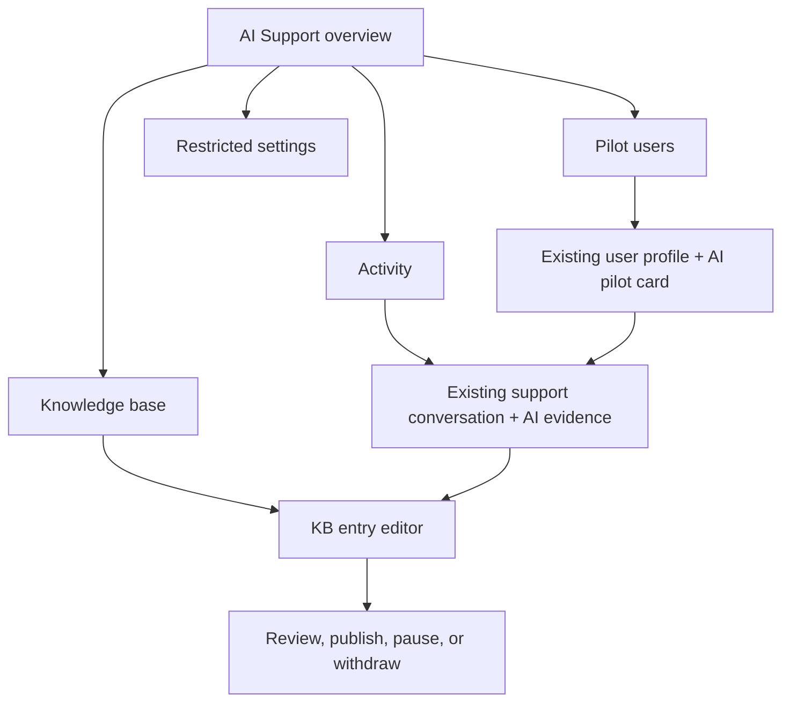

# Admin UX: Pilot Access, KB Management, and Conversation Evidence

Status: Draft interaction specification grounded in accepted `DEC-017`, `DEC-018`, and `DEC-019`

Drafted: August 13, 2026

Owner: Product and design

Required reviewers: Engineering, support operations, design/accessibility, and security/privacy

Related capabilities: `ADM-AI-PILOT-001`, `ADM-KB-001`, and `SUP-HANDOFF-001`

## Purpose

Define the complete administrator experience for safely controlling live pilot access, operating the support-agent knowledge base, and reviewing the exact knowledge and actions used in a support conversation.

This is a UX and behavior contract, not implementation code. Proposed route names describe the intended information architecture and may change during implementation if links, permissions, and behavior remain equivalent.

## Existing-admin alignment

Repository inspection on August 13, 2026 found:

- An existing admin shell and grouped navigation in `resources/views/livewire/layout/navigation.blade.php`.
- Existing user list and user detail routes at `admin.users.index` and `admin.users.show`.
- Existing support queue and conversation detail routes at `admin.support.tickets` and `admin.support.tickets.show`.
- A mature content-operations experience with drafts, review, publishing, immutable revisions, source management, readiness checks, and author/editor/publisher concepts.

The new experience should reuse the existing admin shell, visual components, responsive behavior, feedback patterns, and conflict-handling conventions. It must not reuse blog-post tables, public-article semantics, or broad content permissions as implicit authorization for KB or pilot management. Unlike a separated editorial workflow, `DEC-022` permits either designated KB operator to author, self-review, approve, and publish alone.

## Information architecture

Add a top-level admin navigation group named **AI Support**.

| Navigation item | Proposed route | Primary purpose |
| --- | --- | --- |
| Overview | `admin.ai-support.index` | System safety state, active pilots, KB health, and urgent controls |
| Pilot users | `admin.ai-support.pilots.index` | Find and monitor every exact-user grant |
| Knowledge base | `admin.ai-support.knowledge.index` | Search and operate every KB entry and version |
| Activity | `admin.ai-support.activity.index` | Audit pilot, KB, model, tool, and control-plane events |
| Settings | `admin.ai-support.settings` | Restricted global, capability, provider, and human-only controls |

The existing **People → Admin Users → User Profile Review** page contains the exact-user pilot card. The existing **Care ops → Admin Support → Conversation** page contains the AI evidence panel. Both link back to the AI Support section.



## Shared interaction rules

- Use the established LoLo admin visual language and components rather than an AI-themed sub-application.
- Lead with effective state, not raw configuration. For example, show **AI unavailable — master switch is off**, not five unrelated boolean values.
- Never use color alone for status. Every state has text, icon, and accessible description.
- Destructive or exposure-changing actions require an explicit modal, impact summary, and reason.
- Every mutation disables repeat submission, handles conflict, and returns a specific success or failure message.
- All times show the administrator's timezone plus an exact timestamp on hover/details.
- Tables support keyboard navigation, meaningful focus order, persistent filter state, and pagination.
- Critical disable, pause, and transfer actions remain usable on a narrow mobile viewport even though content authoring is desktop-first.
- Never expose private model reasoning. Show observable events, inputs allowed by policy, KB evidence, tool results, and stable reason codes.

## Screen 1 — AI Support overview

Proposed route: `admin.ai-support.index`

Required permission: `ai_pilot.view` or `kb.view`; each card/action is further permission-gated.

### User outcome

An authorized administrator can answer, within seconds:

- Is any customer-facing AI currently possible?
- Exactly how many live users have active grants?
- Is the assistant healthy or in human-only mode?
- Is any KB content paused, overdue, conflicting, or blocking a capability?
- Is there an incident or anomalous exposure requiring immediate action?

### Layout

```text
AI Support                                      [Human-only mode]
System status: PILOT / AI ON / 12 exact users   Last checked 10:42

[Customer AI state] [Active grants] [KB health] [Last 24h cost]

Urgent attention
- 1 grant expires today
- 2 published entries overdue for review
- 0 non-granted exposure anomalies

Pilot activity                   Knowledge activity
Recent grants/revocations        Recent publish/pause/withdraw actions

Capability state table
Capability | roles | live grants | status | failures | action
```

### Header state

Show one unambiguous state:

- **AI off globally** — no user can invoke AI.
- **Human-only mode** — AI is suppressed; human support remains available.
- **Pilot active** — customer-facing AI is possible only for named grants.
- **Degraded** — a required dependency is unavailable; effective behavior is fail-closed.
- **Incident hold** — re-enable requires documented incident/release approval.

Do not label the system simply **On** when the master switch is on but user-visible replies, provider, or all capabilities are off.

### Summary cards

1. **Customer AI state** — effective state and the first blocking/allowing reason.
2. **Active pilot grants** — exact count; scheduled and expiring counts; link to Pilot users.
3. **KB health** — published, drafts, paused, conflicts, and overdue review.
4. **Usage and cost** — conversations, safely completed outcomes, escalations, and cost for the selected period.

### Urgent attention

Show only actionable items:

- Eligibility anomaly or attempted non-granted access
- Critical model/tool/safety failure
- Grant expiring soon while an active conversation exists
- Published KB entry with a conflict, failed route, or expired review
- Capability automatically paused
- Failed audit/event write

### Actions

- **Human-only mode** is always visible to administrators with incident-control permission.
- Turning human-only mode on requires a reason and impact confirmation; it acts immediately.
- Re-enabling does not use a casual toggle. It opens the Settings release confirmation and previews which grants/capabilities would become effective.
- Overview contains no bulk-enable action.

### Empty and error states

- No grants: **No pilot users are enabled. AI remains unavailable to live users.**
- No KB: **No knowledge is published. The assistant cannot answer product questions.**
- Control service unavailable: display **AI is failing closed** and suppress misleading counts.

## Screen 2 — Pilot users

Proposed route: `admin.ai-support.pilots.index`

Required permission: `ai_pilot.view`; under `DEC-020`, grant mutation additionally requires the actor to be an existing full administrator with `ai_pilot.manage`.

### Header

- Title: **AI pilot users**
- Description: **Only users listed with an active grant can access customer-facing AI. Access never extends to other members of their account.**
- Primary action: **Find a user to enable**
- Secondary action: **Export grant audit** only if privacy/operations approves an export format; never export transcripts here.

### Metrics

- Effective now
- Scheduled
- Expiring within seven days
- Revoked within 30 days
- Blocked by a higher-level control

### Search and filters

- Search exact name, email, user ID, or grant ID.
- Status: Effective, Scheduled, Expired, Revoked, Blocked.
- Role: Family/care-receiver or caregiver.
- Capability bundle.
- Start/expiry range.
- Created or revoked by.
- Has active AI conversation.

### Table

| Column | Content |
| --- | --- |
| User | Name, masked/appropriate email, stable user ID, role |
| Effective status | Effective, Scheduled, Blocked, Expired, or Revoked plus reason |
| Capability scope | Approved bundle/version, not a raw tool list |
| Start / expiry | Exact timestamps; **No expiry** is visually explicit |
| Last AI activity | Timestamp or **Never used** |
| Granted by | Administrator and reason summary |
| Audit deletion | Expected deletion date or documented hold, according to the approved retention class |
| Actions | Open user; Disable now when effective; View history |

Default sort: effective grants first, then soonest expiry. Revoked/expired records remain searchable but do not crowd the default active view.

### Find-a-user flow

Search uses the existing user directory and shows:

- Name, email, stable ID, current role, account membership summary
- Existing effective/scheduled grant status
- Whether the role is supported by any released pilot bundle
- A clear **Open user** action

There is no checkbox selection and no multi-user enable action.

### Empty states

- No grants: explain that production AI is unavailable until an exact user is enabled.
- No filter result: preserve filters and offer **Clear filters**, not **Enable everyone**.

## Screen 3 — Existing user profile: AI pilot card

Existing route: `admin.users.show`

Placement: directly after the user identity summary and before caregiver- or family-specific operational sections. This keeps access state visible without mixing it into identity verification, family ownership, or caregiver moderation.

Visibility:

- Administrators with `ai_pilot.view` see the card.
- Other admins do not see a disabled or teaser card.
- Mutation controls render only with `ai_pilot.manage` and remain server-authorized.

### Disabled state

```text
AI pilot access                                      NOT ENABLED
This user receives the existing human-support experience.
No customer-facing model calls are allowed for this user.

Role: Family          Effective blocker: No active user grant
Account inheritance: Never

                                      [Enable AI pilot]
```

### Effective state

```text
AI pilot access                                      ENABLED
Family support pilot v1
Started Aug 13, 2026 10:30  •  Expires Aug 27, 2026 10:30
Granted by Alex Admin  •  Reason: scheduled usability pilot

Global state: Pilot active       Last AI activity: 12 minutes ago
[Open conversation] [View grant history]             [Disable now]
```

### Blocked state

The card distinguishes stored grant state from effective access:

> Grant is active, but AI is currently unavailable because Human-only mode is on.

Do not present this as **Enabled** without the blocker.

### History

An expandable history lists creation, scope changes implemented as revoke-plus-new-grant, scheduled activation, expiry, revocation, role/account invalidation, actor, reason, timestamps, and the audit record's expected deletion date. When deletion is suspended, show **On legal/security hold**, its non-sensitive reason category, approver, review/expiry date, and link to the authorized hold record.

## Screen 4 — Enable AI pilot dialog

Entry points: user profile **Enable AI pilot** and Pilot users **Find a user to enable**.

Required permission: an existing full administrator with `ai_pilot.manage` under `DEC-020`.

### Dialog title and identity protection

Title: **Enable AI pilot for {user name}?**

Display name, email, stable ID, current role, and account summary at the top. Use a warning when another member of the same account is already enabled, explaining that grants remain separate.

### Fields

1. **Capability bundle** — required; only approved bundles valid for the current role. Show plain-language inclusions and exclusions.
2. **Start** — **Now** or scheduled date/time.
3. **Expiry** — 14 days after activation by default under `DEC-021`. A full administrator may choose another expiry. Selecting **No expiry** requires an explicit acknowledgment that access continues until manual revocation.
4. **Reason** — required, concise operational reason; do not place sensitive care details here.

### Impact summary

Before confirmation, show:

- Only this exact user receives access.
- Other family/account members remain off.
- The user will see clear AI identification and **Talk to a person**.
- Global, capability, safety, role, and human-only controls still apply.
- The grant can be revoked immediately.

### Confirmation

Primary: **Enable for this user**

Secondary: **Cancel**

On success, close the dialog, announce success accessibly, refresh effective state, and write the grant audit. A double submission must create one grant.

### Failure states

- Role changed: stop and reload the user.
- Existing active grant: show it; do not create a duplicate.
- Bundle was paused between open and confirm: refuse and explain.
- Audit write fails: grant creation fails atomically.
- Global AI off: grant may be scheduled/stored only if product allows; the dialog must say it will remain ineffective. It never silently turns global AI on.

## Screen 5 — Disable AI pilot dialog

Entry points: user profile and Pilot users row action.

Title: **Disable AI for {user name} now?**

### Required content

- Explain that no new AI replies or actions will be allowed.
- Explain that an undelivered in-flight reply will be suppressed.
- Explain that the conversation and human support remain available.
- Show whether an automated conversation will become human-only.
- Require a reason without sensitive care details.

Primary destructive action: **Disable AI now**

On success, the UI must show **Revoked** only after the server confirms effective denial. If revocation succeeds but a downstream notification fails, access remains revoked and operations receives an alert.

## Screen 6 — Knowledge-base list

Proposed route: `admin.ai-support.knowledge.index`

Required permission: `kb.view`; create requires `kb.edit`.

### Header

- Title: **Support knowledge base**
- Description: **Only published, current, role-applicable entries can be used in customer-facing answers.**
- Primary action: **New KB entry**
- Secondary links: Sources, capabilities, evaluations, and activity when those views exist.

### Status summary

Use selectable summary cards or tabs:

- Needs attention
- Drafts
- In review
- Approved
- Published
- Paused
- Overdue
- Withdrawn/deleted

**Needs attention** is the default and combines blocking validation, conflicts, overdue review, failed routes, and missing evaluations. It is not a lifecycle status.

### Search and filters

- Full-text search across title, stable KB ID, approved answer, facts, and source labels.
- Status and entry type.
- Role/applicability and account state.
- Product area, capability, route, or semantic target.
- Owner and optional reviewer/subject-matter contact.
- Sensitivity and jurisdiction.
- Effective/review date.
- Source status.
- Validation result and conflict state.

### Table

| Column | Content |
| --- | --- |
| Entry | Title, stable KB ID, type |
| Roles | Family/care-receiver, caregiver, or both only when explicitly valid |
| Status | Lifecycle status plus effective/paused/overdue qualification |
| Live version | Exact published version or **None** |
| Working version | Draft/review version when present |
| Owner / contact | Named owner and optional reviewer/subject-matter contact |
| Review date | Date plus overdue indicator |
| Usage / quality | Recent retrieval count, correction/escalation indicator when available |
| Actions | Open; Pause for authorized published entry; More menu |

Never compress published and working-draft state into a single misleading status. An entry can have live version 3 while version 4 is a draft.

### Row behavior

Opening a row goes to the editor/detail page. **Pause** is available as an urgent action but still requires a reason and confirmation. Delete is not a casual row action; it belongs in the entry danger zone after dependency inspection.

### Empty states

- Entire KB empty: explain that no product answers can be released and offer **New KB entry**.
- Published filter empty: **No KB entries are currently eligible for customer-facing retrieval.**
- Search empty: preserve query and offer clear filters.

## Screen 7 — KB entry editor and detail

Proposed routes:

- `admin.ai-support.knowledge.create`
- `admin.ai-support.knowledge.edit`

Required permission: `kb.view`; fields/actions depend on `kb.edit`, `kb.review`, `kb.publish`, `kb.delete`, and `kb.sensitive_approve`.

### Page shell

```text
← Knowledge base     KB-FAM-REQUEST-STATUS-001     DRAFT v4
Care request status and next steps
[Preview as family user] [Save draft] [Submit for review]

┌ Main content ─────────────────────┐ ┌ Readiness ──────────────┐
│ Entry type and title              │ │ 3 blocking issues       │
│ Approved answer / procedure       │ │ Sources                 │
│ Facts the agent may state         │ │ Roles & applicability   │
│ Facts it must not infer           │ │ Owner & optional contact│
│ Escalation and next actions       │ │ Effective/review dates  │
│ Change note                       │ │ Evaluations & routes     │
└───────────────────────────────────┘ └─────────────────────────┘

[Version history] [Dependencies] [Usage] [Activity] [Danger zone]
```

### Identity and version

- The server assigns a stable KB ID when the first draft is created.
- The KB ID is visible, copyable, and immutable.
- Title is editable through a new version.
- Show live version, working version, lifecycle status, effective status, and last save separately.
- Editing a published entry begins or opens a new draft version; it never mutates live content.

### Main content sections

1. **Purpose and type** — product fact, task playbook, navigation entry, or escalation playbook.
2. **Approved answer or procedure** — plain-language customer-facing truth.
3. **Facts the agent may state** — explicit atomic claims.
4. **Facts the agent must not infer** — boundaries and neighboring cases.
5. **Approved next actions** — capability/semantic-target references, never free text as executable authority.
6. **Escalation conditions** — deterministic or content-guided reasons.
7. **Change note** — required before review, describing why this version exists.

### Applicability panel

- Role: family/care-receiver and/or caregiver.
- Account/member states.
- Product area and relevant route/screen IDs.
- Capability IDs.
- Jurisdiction and product version when applicable.
- Effective and review-by dates.
- Sensitivity classification.

Selecting both major user tracks requires an explicit acknowledgment that wording and facts truly apply to both. The readiness check warns when role-specific terms suggest the entry should be split.

### Sources panel

- Add only entries from the approved source register.
- Show source owner, authority status, effective date, and supersession/conflict state.
- A source conflict blocks publication and offers **Pause live entry** when applicable.
- Support transcripts and model suggestions may be linked only as discovery evidence and are visibly marked **Not authoritative**.

### Evaluations and validation

Show:

- Required related evaluation IDs and latest result.
- Metadata completeness.
- Role/applicability conflicts.
- Route and semantic-target resolution.
- Contradiction checks against entries with overlapping applicability.
- Plain-language and required-caveat checks.
- Publication blockers separately from warnings.

No overall score may hide a blocker.

### Preview

**Preview as user** lets the administrator select only a valid declared role/state scenario and shows:

- The exact content available to the model.
- A representative concise response or deterministic template preview.
- Approved next actions.
- Required caveats and escalation.
- What is deliberately excluded.

Preview is clearly labeled as non-production and cannot execute tools or publish content.

### Save behavior

- Manual **Save draft** is always available to editors.
- Autosave may be used if it clearly shows Saving, Saved, or Conflict.
- Use optimistic concurrency. A stale editor cannot overwrite another edit.
- On conflict, preserve the administrator's work and provide compare/copy/merge choices.

## Screen 8 — Review and publication

This is a panel/state within the KB editor rather than a disconnected workflow. Under `DEC-022`, review is a recorded self-check and not a second-person gate; either designated KB operator may author, approve, and publish the same version.

### Submit for review

Requirements:

- Change note present.
- Required metadata present enough for review.
- An authorized KB operator is identified to record the review; this may be the author.
- Validation summary shown.

Submitting freezes the review candidate. Further editing creates a new draft or invalidates the current review according to the implementation's version model; it never changes reviewed content silently.

### Review experience

Show a side-by-side diff against the live or prior version, with separate sections for:

- Customer-facing answer/procedure
- Allowed/prohibited facts
- Roles and applicability
- Sources
- Escalation and next actions
- Effective/review dates
- Evaluations and readiness

The authorized operator records **Approve** or **Return to draft** plus required notes. The operator may be the author and may publish the approved version. Sensitive checks are separately identified, but the same authorized operator may complete them.

### Publish confirmation

Title: **Publish KB version {version}?**

Show:

- Exact roles and states that may retrieve it.
- Capabilities affected.
- Version being replaced, if any.
- Effective and review-by dates.
- Evaluation result and unresolved warnings.
- Number of currently active pilot users in affected roles.

Primary: **Publish this version**

Publication is atomic. Under `DEC-023`, the first release offers **Publish now** only and blocks a future effective date. The UI shows Published only after the immutable version and audit event both succeed. Content intended for later remains draft or approved until manually published.

## Screen 9 — Pause, supersede, delete, and withdraw

### Pause published entry

Use when truth is uncertain or unsafe.

- Require a reason.
- Show affected capabilities and approved fallback/human-transfer behavior.
- Apply immediately without deployment.
- Keep the entry, versions, dependencies, and evidence visible to admins.
- Offer **Create corrective draft**.

### Supersede

Publishing a replacement links old and new versions. The old version remains visible as historical evidence and is excluded from new retrieval.

### Delete never-released draft

Allow permanent deletion only when:

- No version has ever been approved or published.
- No protected conversation, evaluation, capability, route, or source dependency requires it.
- The administrator has `kb.delete`.
- The confirmation shows the stable KB ID/title and requires a reason.

Primary: **Permanently delete draft**

### Delete released entry

User-facing label: **Withdraw and delete from active KB**

Explain clearly:

- It is removed from retrieval immediately.
- The full released version, usage links, and compact lifecycle audit remain for 36 calendar months after retirement, extended only for retained dependencies.
- Full content is then deleted and a content-free tombstone remains for 24 additional months; the stable ID is never reused.
- Existing conversation history does not change.
- A replacement may be required for affected capabilities.

Require the administrator to enter the stable KB ID and a reason. Primary: **Withdraw entry**.

The action is blocked when it would leave a safety-critical capability without its required fallback unless the affected capability is atomically paused in the same operation.

## Screen 10 — Support conversation AI evidence

Existing route: `admin.support.tickets.show`

Placement: add an **AI evidence** section/drawer to the existing support conversation detail. Keep human messages and claim/reply controls primary.

### Conversation header badges

- Responder state: Automated, Transferred to human, or Human assigned.
- Pilot grant state at the time of each AI turn, not only current grant state.
- Capability and risk class.
- Any incident, denial, or suppression marker.

### Per-turn evidence

For each automated response show expandable evidence:

- Exact model/configuration and prompt/tool schema versions.
- Capability routed and stable reason code.
- KB IDs and exact immutable versions retrieved.
- Applicability result and source links.
- Navigation proposal/result or tool preview/receipt.
- Confirmation event when applicable.
- Latency and cost.
- Validation, denial, transfer, or suppression events.
- Retention class and expected deletion date for the canonical transcript and each separately retained evidence record.

Do not show private chain-of-thought. A concise generated summary is labeled as a convenience and never replaces original events. If a referenced record has expired, show a content-free deletion marker and date; do not imply the missing content is an application failure.

### KB link behavior

Opening a KB reference shows the exact historical version used, even when the entry is now paused, superseded, or withdrawn. The panel also shows its current state without pretending the past turn used current content.

### Actions

- **Open KB version**
- **Report KB issue** — creates a review task/draft suggestion, never edits live content.
- **Pause entry** when authorized and urgent.
- **Open pilot grant history**
- **Transfer to human** when still automated
- **Open tool receipt** or relevant authorized domain record

## Screen 11 — AI Support activity

Proposed route: `admin.ai-support.activity.index`

Purpose: searchable control-plane audit, not a replacement for domain audit or support transcripts.

### Filters

- Event family: pilot access, eligibility, KB, capability/control, model, tool, transfer.
- Actor administrator, target user, grant ID, KB ID/version, conversation, capability.
- Result: success, denied, failed, conflict, suppressed.
- Date range and environment.

### Event detail

Show actor, action, target, prior/effective state, reason, timestamps, safe metadata, related records, result, retention class, expected deletion date, and hold state. Do not show full sensitive transcript content in the general activity list.

## Screen 12 — Restricted settings and emergency controls

Proposed route: `admin.ai-support.settings`

Required permission: dedicated incident/release control; ordinary KB or support permissions are insufficient.

### Controls

- Production AI master
- User-visible AI replies
- Shadow mode
- Capability states
- Tool states
- Class D commit
- Model/provider configuration reference and safe fallback state
- Navigation target states
- Global human-only mode

### Safety behavior

- Default and unknown state is off/denied.
- Enabling a control shows every exact grant/capability that would become effective.
- Re-enable after incident hold requires incident/release reference and confirmation.
- Disabling is immediate and does not require deployment.
- Settings cannot create users or KB content.
- Every change is audited and reflected on the overview.

## Notifications

Use in-app admin notifications for:

- Grant scheduled, activated, expiring, expired, or revoked
- Eligibility anomaly/non-granted invocation attempt
- KB submitted for review, approved, requested changes, published, paused, or withdrawn
- Review due/overdue and source conflict
- Failed mutation or audit event
- Automatic capability pause or incident hold

Do not include sensitive transcript or care details in notification previews.

## Accessibility and responsive behavior

- Every form field has persistent label, help text where necessary, and inline error associated programmatically.
- Modals trap focus, announce title/impact, support Escape when safe, and return focus to the invoking control.
- Status chips expose meaningful accessible text.
- Tables provide a mobile card alternative or horizontal strategy without hiding actions.
- Minimum interactive target follows existing product accessibility standards.
- Review diff supports screen readers and does not rely solely on red/green formatting.
- Unsaved/conflicted edits are announced and never silently discarded on Livewire navigation.
- Critical **Disable now**, **Human-only mode**, and **Pause entry** actions remain reachable on mobile.

## Permission matrix by screen

| Screen/action | View | Manage/edit | Review | Publish/control | Delete |
| --- | --- | --- | --- | --- | --- |
| Overview | `ai_pilot.view` or `kb.view` | — | — | Incident control for emergency action | — |
| Pilot list/user card | `ai_pilot.view` | `ai_pilot.manage` | — | — | Revocation uses manage |
| KB list/editor | `kb.view` | `kb.edit` | `kb.review` | `kb.publish` | `kb.delete` |
| Sensitive approval | `kb.view` | Optional `kb.edit` | `kb.sensitive_approve` | Same operator may also publish | — |
| Conversation evidence | Existing support authorization plus evidence permission | Report issue | — | Pause only with `kb.publish` | — |
| Settings | Restricted operational view | — | — | Dedicated incident/release control | — |

All permissions are enforced by server policy on every action. Route middleware or hidden buttons alone are insufficient.

## End-to-end acceptance journeys

### Pilot access

1. Admin opens a family user's existing profile and sees **Not enabled**.
2. Admin grants an approved answer-only bundle for 14 days with a reason.
3. User becomes effectively eligible only after server confirmation.
4. Another member of the same family remains completely AI-ineligible.
5. Admin sees the granted user's conversation and exact AI evidence.
6. Admin disables access during an in-flight turn; the reply is suppressed and human support remains.
7. Direct endpoint and stale-page attempts after revocation cause no model call.

### KB lifecycle

1. Editor creates a new Draft from an authoritative source.
2. Draft cannot appear in customer-facing retrieval.
3. Editor completes role, facts, exclusions, escalation, source, date, and evaluation fields.
4. The same editor may compare the version, complete the self-review, and approve with notes.
5. That operator sees affected roles/capabilities and publishes atomically.
6. A pilot conversation records the exact published version used.
7. Admin pauses it; subsequent retrieval excludes it immediately.
8. Editor publishes a corrected version or withdraws the entry with tombstone evidence.

### Failure containment

1. Grant/control store becomes unreadable; user gets human support and no model call.
2. KB store/version state becomes uncertain; affected answer is suppressed or transferred.
3. Admin mutation conflicts; no silent overwrite occurs.
4. Audit write fails; exposure-changing mutation fails atomically.

## Analytics events

Record safe UI/product events for:

- Page viewed and filter used
- Grant dialog opened, confirmed, cancelled, succeeded, or failed
- Revoke dialog opened, confirmed, succeeded, or failed
- KB draft created/saved/conflicted/submitted/reviewed/published/paused/withdrawn/deleted
- Readiness blocker opened
- Historical KB version opened from conversation
- Emergency control opened/confirmed

Analytics never replaces the authoritative audit and must not include KB body content, transcript content, or unnecessary user details.

## Implementation notes for GPT-5.6 Sol

- Extend the existing admin route, Livewire, layout, component, notification, and policy conventions.
- Add the pilot card to the existing `UserShow` experience rather than creating a duplicate user directory.
- Add evidence to the existing `SupportTicketShow` experience rather than creating a second transcript.
- Reuse the editorial workflow's proven UX concepts—draft, review, immutable revision, readiness, sources, conflict detection—but implement a separate KB domain and permissions.
- Do not copy any independent-review restriction from the editorial workflow: either designated KB operator must be able to complete every KB lifecycle action alone under `DEC-022`.
- Do not treat the current broad `admin.email` middleware as sufficient authorization for pilot grants, KB publication, deletion, or incident controls.
- Do not bind authorization solely to `content_role`; define the accepted AI/KB permissions and policies.
- Do not implement a bulk pilot enable action.
- Do not expose an AI navigation group or status to normal users; this specification concerns administrators only.

## Open product/design decisions

These do not weaken the accepted default-off, exact-user, or KB-governance requirements:

| ID | Question | Recommendation | Needed before |
| --- | --- | --- | --- |
| `UX-AUDIT-001` | Do every diagnostic, provider, export, cache/index/replica, analytics, and backup destination meet `DEC-058`? | Show the configured class, expiry, failure/overdue state, and content-free deletion/restore evidence | Production data design |

## Accepted UX decisions

| ID | Decision | Accepted |
| --- | --- | --- |
| `UX-ADM-001` / `DEC-020` | Only existing full administrators may enable, schedule, or revoke pilot-user AI access during the initial pilot. | August 13, 2026 |
| `UX-ADM-002` / `DEC-021` | Grants expire 14 days after activation by default; another date is allowed; **No expiry** requires explicit acknowledgment; renewal creates a new audited grant. | August 13, 2026 |
| `UX-KB-001` / `DEC-022` | Either designated KB operator may author, self-review, approve, publish, pause, supersede, withdraw, or delete alone; no second person is required. | August 13, 2026 |
| `UX-KB-002` / `DEC-023` | The first KB release supports manual **Publish now** only; scheduled or future-effective publication is excluded. | August 13, 2026 |
| `UX-KB-003` / `DEC-022` | Either designated KB operator may withdraw a released entry alone; normal withdrawal preserves its tombstone and historical evidence. | August 13, 2026 |
| `UX-AUDIT-002` / `DEC-024` | Keep customer text only as long as needed; retain smaller evidence longer only for a defined purpose; auto-delete expired data; show deletion dates and authorized holds. | August 13, 2026 |
| `UX-AUDIT-003` / `DEC-029` | Keep grants while scheduled/active and AI control versions while effective, then for 24 calendar months; retain unsuccessful control attempts for 24 months; dependency extensions are bounded. | August 13, 2026 |
| `UX-AUDIT-004` / `DEC-030` | Keep full released KB versions for 36 calendar months after final retirement, then content-free tombstones for 24 additional months; protected dependencies extend only as needed and stable IDs are never reused. | August 13, 2026 |
| `UX-AUDIT-005` / `DEC-031` | Keep content-free deletion evidence for 36 calendar months after success or resolution; hold/exception evidence remains while active plus 36 months. | August 13, 2026 |
