# Capability Specification: `SUP-HANDOFF-001` — Human Handoff Without Repetition

Status: Draft

Version: 0.1

Owner: Support operations

Required approvers: Product, engineering, support operations, security/privacy

Last reviewed: August 13, 2026

## 1. User outcome

A user can ask for a person at any time, or be transferred when automation cannot safely help, while staying in the same support conversation.

User-facing promise:

> LoLo Support receives this conversation and the relevant context already collected, so you do not need to start over.

This capability does not promise an immediate reply unless a support person is actually present.

## 2. Scope

### Supported users

- Signed-in family account owners
- Signed-in active family members
- Signed-in caregivers using the existing human support chat, once agent integration is enabled for their conversation type

### Supported conversation states

- Automated
- Transferred to human; internally unassigned
- Human assigned
- Resolved conversation that may reopen under existing support rules

Closed tickets continue to follow the existing read-only/new-conversation behavior.

### Unsupported neighboring intents

- Emergency response: use the critical safety playbook as well as priority handoff.
- Ownership transfer, billing dispute, or structured incident resolution: route to the applicable human or Support Center workflow; handoff does not itself resolve the issue.

## 3. Risk and autonomy

- Risk class: Platform safety control
- Side effect: Changes the public responder mode to human-only, routes the conversation, and notifies support; does not change care records.
- User confirmation: The user may explicitly select **Talk to a person**. Automatic escalation uses deterministic policy triggers and must explain the transfer.
- Transfer: The server atomically records the transfer, emits the one-time deterministic confirmation, and disables further public automation.
- Human assignment: An authorized administrator explicitly selects **Claim conversation** under the existing atomic assignment rule. Assignment is internal and does not change the already-human-only user experience.

## 4. Trigger language

User-requested examples:

- “I want to talk to someone.”
- “Can a person help me?”
- “This isn't working.”
- “Please stop the bot.”

System-triggered examples:

- No applicable approved KB entry
- Unsupported or restricted capability
- Authorization cannot be safely established
- Repeated material misunderstanding
- Repeated navigation/tool failure
- Critical safety language
- Invalid model output with no safe deterministic fallback

Do not require the user to justify asking for a person.

## 5. Required authorized context

| Field | Purpose | Source | Model access |
| --- | --- | --- | --- |
| Support ticket/conversation ID | Keep one thread | Server | Reference only |
| Authenticated actor and role | Authorization and support context | Server session/policies | Minimized role context |
| Family account reference when applicable | Shared-care boundary | `FamilyAccountContext` | Reference only when needed |
| Origin/current semantic screen | Help support understand location | Safe route/screen registry | Yes, normalized |
| Current capability and risk class | Explain attempted task | Orchestrator | Yes |
| Agent/human ownership state | Prevent collision | Server conversation state | Yes |
| Pending draft reference | Preserve collected work | Capability draft store | Summary only |

The handoff summary must not expand support visibility beyond existing ticket and family-account policies.

## 6. Conversation behavior

### User requested

After a successful transfer, emit the one-time deterministic confirmation:

> I've sent this conversation to LoLo Support. You can keep using this chat, and you won't need to repeat what you already told me.

Do not add queue position, queue status, an automated wait-time update, or a claim that someone is already present.

### System requested

The deterministic transfer confirmation may include the limitation:

> I don't want to give you the wrong help. I'm sending this conversation to LoLo Support.

For emergency or medical cases, the approved safety instruction appears before the general handoff message.

### After transfer

The agent sends no further public message or action. New user messages are preserved in the same conversation for human support. Internal assignment may still be pending, but this state is not presented as an automated queue and produces no queue-status replies.

### After internal assignment

Only human support may reply. The UI continues to show that LoLo Support owns the conversation.

## 7. Handoff summary

The system may generate a concise summary containing:

- User's stated goal
- Confirmed facts and unresolved questions
- Current page
- Capability attempted
- KB entries used
- Navigation/tools attempted and their exact results
- Pending draft state
- Escalation reason and priority

The administrator always has access to the exact transcript and event timeline. The summary is not authoritative evidence.

Do not include hidden reasoning, unrelated account data, secrets, or fields outside the administrator's existing authorization.

## 8. State transition and concurrency

```mermaid
stateDiagram-v2
    [*] --> Automated
    Automated --> HumanSupportUnassigned: atomic transfer; automation stops
    HumanSupportUnassigned --> HumanAssigned: atomic admin claim
    HumanSupportUnassigned --> Automated: deliberate admin return plus user notice
    HumanAssigned --> Resolved: human resolves
    HumanAssigned --> Automated: deliberate admin return plus user notice
    Resolved --> HumanSupportUnassigned: user replies and requests human help
```

Transfer must be atomic. If transfer begins during a model turn, the ownership check before delivery suppresses the in-flight automated reply, except for the server-controlled transfer confirmation. Claiming remains atomic internally: if two administrators claim together, one succeeds and the other sees the actual owner.

Pending Class D confirmations expire when handoff begins. An already-validly-confirmed in-flight commit follows the capability's reconciliation rule, and its receipt appears in the timeline.

## 9. Events and notifications

Required events:

- `escalation_requested`
- `transferred_to_human`
- `handoff_summary_created`
- `support_notified`
- `human_claimed`
- `agent_reply_suppressed`
- `returned_to_automation`, when applicable

Use existing support notification behavior, adding priority/routing only through an approved operations decision. Do not expose sensitive message content in notification previews.

## 10. Safety and failure behavior

| Failure | Behavior |
| --- | --- |
| Summary generation fails | Transfer with the transcript and deterministic reason; do not delay transfer |
| Support notification fails | Keep the conversation human-only, alert operations, and do not restart automation or emit queue-status messages |
| Claim collision | Preserve first valid owner and show actual assignment |
| Ownership state cannot be read | Fail to human-only behavior; suppress new automated public response |
| Support is unavailable | Preserve the message for human support; do not invent queue status or a wait time |

## 11. Evaluation requirements

Critical cases:

- User requests a person using varied plain language.
- User requests a person during a draft.
- User requests a person during a confirmation preview.
- Transfer begins while the model call is in flight.
- Two administrators claim simultaneously.
- Emergency language produces immediate instruction plus priority handoff.
- Summary generation fails.
- Support notification fails.
- Removed family member attempts to continue a shared-care conversation.
- Conversation is returned to automation deliberately.

Gates:

- 100% of explicit human requests enter handoff.
- 100% of transferred conversations become human-only immediately after the deterministic transfer confirmation.
- 100% of in-flight model replies are suppressed when transfer wins the delivery race.
- No transferred conversation receives an automated queue-position, queue-status, wait-time, or acknowledgment message.
- 100% authorization and transcript-visibility tests pass.
- No transfer is delayed by summary generation.
- Older-adult participants can find **Talk to a person** without assistance.

## 12. Rollout

- Implement and test before any user-visible intelligent answer.
- Shadow-test summaries and routing with support staff.
- Exercise human-only fallback and global disable.
- Release for the same user roles as each intelligent capability.

## 13. Open decisions

- `DEC-014`: structured agent-event retention
- `DEC-015`: staffed-hours promise and handoff SLO
